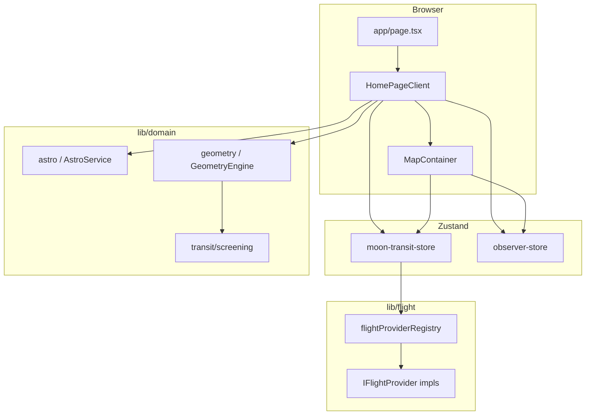

# Architecture — Moon Transit

This document explains how the application is structured, how data moves through it, and where to extend behavior without breaking assumptions.

## Goals (domain)

1. **Observer** — a fixed point on the ground (lat, lng, optional ground height). The moon’s apparent position and all geometry are computed for this point.
2. **Time** — a wall-clock anchor with an optional **simulated** offset (±6 h) to explore future/past transits; ephemeris uses `referenceEpochMs = timeAnchorMs + timeOffsetMs`.
3. **Flights** — `FlightState[]` from a pluggable **flight provider** (Strategy pattern), loaded for the current map bounds.
4. **Transit / alignment** — compare moon azimuth with aircraft position (from altitude) to find “candidates” and “active” alignments within tolerance, plus photographer tools (line-of-sight rate, duration, suggested shutter).
5. **Map** — Mapbox GL: routes, moon azimuth ray, static-route intersections, flights as symbols, observer marker, optional “golden” UI when alignment is within a critical angle.

## High-level layout

- **UI shell** — `src/components/shell/HomePageClient.tsx` — sidebar controls, time slider, flight lists, photographer block, field export; map is a second column (desktop) or below (mobile).
- **Map** — `src/components/map/MapContainer.tsx` — Mapbox, GeoJSON sources, **must** match store updates via effects (`loadFlightsInBounds` on move, etc.).

## State stores

### `useMoonTransitStore` (`src/stores/moon-transit-store.ts`)

| Field / action                                     | Role                                                                             |
| -------------------------------------------------- | -------------------------------------------------------------------------------- |
| `timeAnchorMs`, `timeOffsetMs`, `referenceEpochMs` | Ephemeris and screening use `referenceEpochMs` as the “current simulation time”. |
| `mapView`                                          | Center, zoom, pitch, bearing — updated when the user pans the map.               |
| `flightProvider`                                   | `mock` | `static` | `opensky`.                                                   |
| `flights`                                          | Last loaded snapshot; **not** real-time until next bounds load.                  |
| `selectedFlightId`                                 | Drives photographer tools and list highlighting.                                 |
| `openSkyLatencySkewMs`                             | Manual time skew for display extrapolation (field section).                      |
| `loadFlightsInBounds`                              | Invokes the active `IFlightProvider` and sets `flights` / `error` / `isLoading`. |

### `useObserverStore` (`src/stores/observer-store.ts`)

| Field / action           | Role                                                                                           |
| ------------------------ | ---------------------------------------------------------------------------------------------- |
| `observer`               | `{ lat, lng, groundHeightMeters }` — default near Zagreb; can be GPS or “set from map center”. |
| `observerLocationLocked` | When true, user cannot accidentally move the observer.                                         |
| `mapFocusNonce`          | Incremented to ask `MapContainer` to `flyTo` the observer.                                     |

**Rule:** All moon/plane relative math should use `observer` from this store, not the map’s internal center, unless the feature explicitly is “set observer from view”.

## Flight providers (Strategy)

- **Interface:** `src/types/flight-provider.ts` — `IFlightProvider`: `getFlightsInBounds(FlightQuery)`, optional `getRouteLineFeatures`, `getRouteCorridorStats`.
- **Registry:** `src/lib/flight/flightProviderRegistry.ts` — single cached instance per `FlightProviderId`.
- **Implementations:**
  - `mockFlightProvider` — minimal test data.
  - `staticFlightProvider` — `routes.json` + `staticRoutePointAndBearing` for position/track along a segment.
  - `openSkyFlightProvider` — fetches via `GET /api/opensky/states?...` (bounds), parses states in `parseOpenSkyStates.ts`.

Adding a new source: implement `IFlightProvider`, register in the registry, add the id to `FLIGHT_PROVIDER_IDS` and the sidebar selector.

## Domain layer

- `**lib/domain/astro/`** — `AstroService.getMoonState` wraps moon ephemeris (suncalc-based helpers in `moon.ts`) → `MoonState` (azimuth, altitude, apparent radius, …).
- `**lib/domain/geometry/**` — WGS84 helpers, ENU, horizontal line-of-sight, moon azimuth line vs static routes, **photographer** pack (angular rate, slant range, alignment time) in `GeometryEngine` / `lineOfSightKinematics` / `alignmentHint`.
- `**lib/domain/transit/screening.ts`** — Narrows which flights are worth listing as “candidates”.

Keep **pure functions** in `lib/domain` (no React, no `window` except where a module is explicitly “browser”).

## Extrapolation and latency

- `**extrapolateFlightForDisplay`** — Moves the aircraft along **track** for a short time (seconds) for smooth map display. If `trackDeg` is null, returns the state unchanged (no guess direction).
- **OpenSky skew** — `openSkyLatencySkewMs` is added to the “wall time” when extrapolating, so the user can line up ADS-B delay vs reality.

## API routes (Next.js)

- `**/api/opensky/states`** — Server-side `fetch` to `opensky-network.org` with `lamin, lomin, lamax, lomax` query params. Avoids CORS; returns JSON or 502 on upstream error.

## Map rendering (Mapbox)

- **Sources:** `routes-geo`, `flights-geo`, `moon-azimuth-geo`, `moon-intersections-geo`, `optimal-ground-geo` (names in `MapContainer.tsx`).
- **Flights** — Symbol layer with a rasterized aircraft icon; rotation from `trackDeg` in feature properties. Fallback circle layer if icon creation fails.
- **Observer** — `mapboxgl.Marker` with a custom DOM (camera), not a GeoJSON point.

**Performance:** `loadFlightsInBounds` runs on map move end; don’t add synchronous heavy work in the main map thread without debounce.

## Field / export

- `**lib/field/fieldPlanExport.ts`** — Plain-text “cheat sheet” and a simple PNG (canvas) derived from a snapshot; triggered from the field section in the shell.

## Extension points (checklist for new features)

1. **New flight source** — New `IFlightProvider` + registry + `FLIGHT_PROVIDER_IDS`.
2. **New geometry** — Prefer `lib/domain/geometry` + types in `src/types`.
3. **New UI in sidebar** — `HomePageClient.tsx` or a child under `src/components/`; read/write stores; keep English copy for user-facing strings unless product says otherwise.
4. **Map layers** — Only in `MapContainer.tsx` (or split subcomponents) so layer order and `useEffect` data wiring stay in one place.

## Known limitations (intentional or technical)

- **Flights** are a **snapshot** per bounds load, not a streaming socket.
- **Time slider** does not re-fetch history from OpenSky; it shifts ephemeris and uses the same flight snapshot (documented in UI for OpenSky use).
- **Compass** uses device orientation where available; accuracy varies by device and environment.

## Related files

- App entry: `src/app/page.tsx`, `src/app/layout.tsx`
- Human docs: `README.md` (root), `documentation/README.md` (index of architecture / conventions / changelog)
- Map token: `NEXT_PUBLIC_MAPBOX_TOKEN`
- Route data: `src/data/routes.json`, `src/data/staticRouteUtils.ts`

