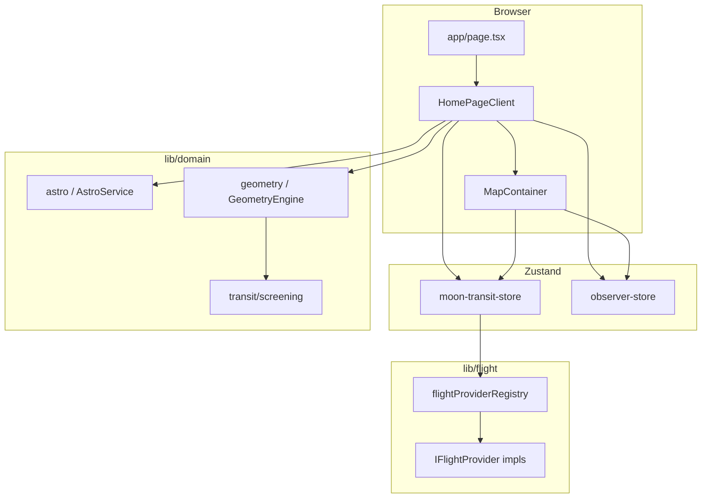

# Architecture — LunaPic

This document explains how the application is structured, how data moves through it, and where to extend behavior without breaking assumptions.

## Goals (domain)

1. **Observer** — a fixed point on the ground (lat, lng, optional ground height). The moon’s apparent position and all geometry are computed for this point.
2. **Time** — **Sync** sets `timeAnchorMs` to wall-clock **now**; the slider scrubs **forward** by `timeOffsetMs` up to a **civil day** (~24 h): `referenceEpochMs = timeAnchorMs + timeOffsetMs` is the “current simulation time”. **Moonrise / moonset** from suncalc still drive ephemeris UI and which **map moon-path arc** is drawn as the primary (visible) segment; they do not define the slider extent. **Sync** bumps ephemeris refresh; crossing a **UTC calendar day** while scrubbing also bumps so rise/set stay aligned with `referenceEpochMs`.
3. **Flights** — `FlightState[]` from a pluggable **flight provider** (Strategy pattern), loaded for the current map bounds.
4. **Transit / alignment** — compare moon azimuth with aircraft position (from altitude) to find “candidates” and “active” alignments within tolerance, plus photographer tools (line-of-sight rate, duration, suggested shutter).
5. **Map** — Mapbox GL: routes, **moon path** (primary dashed arc for the visible rise→set window when known, plus a **low-contrast full-day** path for the whole UTC day), **simulated-instant marker** on the path, **moon azimuth** at `referenceEpochMs`, optional **NOW** wall-clock moon pointer (cyan), static-route intersections, flights as either a **3D model layer** (airplane glTF) or a lightweight **ATC-style** 2D overlay (`mapDisplayMode`, see *Map aircraft display mode* below), observer marker, global **raster DEM** for `**queryTerrainElevation`** (observer **ground height** when the browser does not supply GNSS altitude or when the user places the observer on the map), **selected-aircraft stand** (cyan footprint + zero-offset spine + 3D volume linked to observer direction and moon elevation), observer-centric **transit opportunity corridor** (green LOW/MEDIUM/HIGH confidence bands + 3D volume, shown only when moon field visibility is **Optimal**), short **selected-flight trajectory** with altitude-aware 3D offset when an aircraft is picked, optional “golden” UI when alignment is within a critical angle.

## High-level layout

- **UI shell** — `src/components/shell/HomePageClient.tsx` — sidebar (izvori, Mjesec, kandidati, tranziti) i alati (fotograf, kompas, polje); ispod `md` karta s `h-dvh` ispunjava srednji segment, kontrole u donjem „decku” s dva taba, jedna instanca mape. Na desktopu tri stupca kao prije. Map u drugom stupcu; map mora ostat **jedna** `MapContainer` instanca.
- **Map** — `src/components/map/MapContainer.tsx` — Mapbox, GeoJSON sources, **must** match store updates via effects (`loadFlightsInBounds` on move, etc.). Receives `**fieldSoundsEnabled`** from the shell when **Field sounds** are on: `useTransitFieldSounds` plays a **chime** when the **selected** aircraft enters the **green** (shot-feasible) set (`computeShotFeasibleFlightIds`, same rules as map tint) and a **soft hold tone** while it stays in the **moon-overlap** disc model (`screenTransitCandidates`); short tones live in `src/lib/audio/fieldAudio.ts` using a **shared `AudioContext`** primed from a **user tap** (`primeFieldAudioFromUserGesture` on **Sounds on**, `resumeSharedAudioFromUserGesture` on **Sync** — needed on iOS Safari before effect-driven audio). Countdown **beeps** (≈3 s before alignment and at alignment) remain in `useTransitBeep` (`useHomeShellOrchestration` + `usePhotographerTools`).

## State stores

### `useMoonTransitStore` (`src/stores/moon-transit-store.ts`)

| Field / action                                                | Role                                                                                                                                                                                                                                                                                                                                                                                                                                                                       |
| ------------------------------------------------------------- | -------------------------------------------------------------------------------------------------------------------------------------------------------------------------------------------------------------------------------------------------------------------------------------------------------------------------------------------------------------------------------------------------------------------------------------------------------------------------- |
| `timeAnchorMs`, `timeOffsetMs`, `referenceEpochMs`            | Ephemeris and screening use `referenceEpochMs` as the “current simulation time”. `**getTimeSliderWindowMs`** returns `[timeAnchorMs, timeAnchorMs + 24h)` (civil day forward from the last **Sync**); `timeAnchorMs` does not move when scrubbing.                                                                                                                                                                                                                         |
| `moonRise`, `moonSet`, `moonRiseSetKind`                      | Suncalc rise/set for ephemeris panels and for **which segment** of the day is highlighted as the primary **visible** moon path on the map; **not** the slider extent. From `AstroService.getMoonTimes` via `useAstronomySync`.                                                                                                                                                                                                                                             |
| `ephemerisRefetchKey`                                         | Bumped in `syncTimeToNow` and when `setTimeOffsetMs` crosses a **UTC calendar day** so `useAstronomySync` re-fetches `getMoonTimes` for the simulated day; not on every slider step within the same UTC day.                                                                                                                                                                                                                                                               |
| `setMoonRiseSet`                                              | Writes rise/set; re-clamps `referenceEpochMs` / `timeOffsetMs` into `[timeAnchorMs, timeAnchorMs+24h)` when the anchor is set.                                                                                                                                                                                                                                                                                                                                             |
| `mapView`                                                     | Center, zoom, pitch, bearing — updated when the user pans the map.                                                                                                                                                                                                                                                                                                                                                                                                         |
| `flightProvider`                                              | `mock` / `static` / `opensky` / `adsbone` (see `FlightProviderId`). **Default:** `opensky`. When both live REST feeds are enabled, `flightProvider` stays `**opensky`** for corridor / debounce while `**liveFlightFeeds**` tracks the mask.                                                                                                                                                                                                                               |
| `liveFlightFeeds`                                             | `{ opensky, adsbone }` booleans — **live mode only** (checkboxes on the **OpenSky** / **ADS-B One** rows inside the **Flight source** combobox menu). **Default:** both `true`. At least one must stay on. Same **ICAO24** is merged into one `FlightState` (`mergeLiveFlightLists.ts`).                                                                                                                                                                                   |
| `flights`                                                     | Last loaded snapshot; **not** real-time until next bounds load.                                                                                                                                                                                                                                                                                                                                                                                                            |
| `selectedFlightId`                                            | Drives photographer tools, list highlighting, and the **stand** overlay on the map.                                                                                                                                                                                                                                                                                                                                                                                        |
| `openSkyLatencySkewMs`                                        | Manual time skew for display extrapolation (field section).                                                                                                                                                                                                                                                                                                                                                                                                                |
| `cameraFocalLengthMm`, `cameraSensorType`                     | Photographer optical setup (default **600 mm**, **full frame**). Crop factors: `**fullFrame` 1.0×**, `**apsC` 1.5×**, `**apsC16` 1.6×** (typical Canon APS-C), `**microFourThirds` 2.0×**. Drives shot-feasibility, map feasible tint, corridors, and viewfinder effective focal.                                                                                                                                                                                          |
| `cameraPresetId`, `cameraFrameWidthPx`, `cameraFrameHeightPx` | **Preset** (`CameraPresetSelect`): fixed bodies from `src/lib/camera/cameraPresets.ts` apply **sensor + output resolution**; `**other`** lets the user pick **sensor** and **frame width/height** (px). Store holds the active output size for **Shot feasibility** copy and `**ViewfinderPreview`** scale labels (initially **6000×4000** until a preset overrides it).                                                                                                   |
| `syncTimeToNow`                                               | “Sync” and initial shell layout: `timeAnchorMs` = now, `timeOffsetMs` = 0, `referenceEpochMs` = now; bump `ephemerisRefetchKey`.                                                                                                                                                                                                                                                                                                                                           |
| `loadFlightsInBounds`                                         | For **static/mock**, one `IFlightProvider`. For **live**, `Promise.allSettled` over each enabled id, then `**mergeLiveFlightLists`** when both succeed, then `**mergeFlightsWithOpenSkyRetention**` (after `**mergeStickyFlightMetadata**`) — for `**opensky**` / `**adsbone**` / dual keeps short-lived feed gaps smoother on mobile; clears retention when `**setFlightProvider**` or `**setLiveFlightFeeds**` changes the mask. Sets `flights` / `error` / `isLoading`. |
| `mapDisplayMode`, `setMapDisplayMode`                         | `**default**` (UI: **3D Model**) vs `**atc`** (**ATC Style**). Drives `useMapDisplayMode`, visibility of the 3D flight layer vs ATC GeoJSON layers, and reapplies altitude tint paint. Stored in `**types/map-display.ts`**.                                                                                                                                                                                                                                               |
| `patchFlightAircraftTypeFromIndex`                            | Writes `**aircraftType**` on a single `FlightState` from the OpenSky aircraft index when the label was empty (idempotent if type already set). Used by `**SelectedAircraftMapPopup**` on selection and by `**useFlightAircraftTypeIndexPrefetch**` for background fill.                                                                                                                                                                                                    |

**Design note (bounded context):** The store combines **simulated time**, **map view state**, and **flight loading + selection** in one Zustand slice. This is an **intentional aggregate** for a small app: a single `loadFlightsInBounds` can depend on time and provider without cross-store sync. A future split into `timeStore` / `flightsStore` / `mapViewStore` is optional; see `src/stores/README.md` (Croatian summary), `documentation/optimization-and-refactoring.md`, and `documentation/technicalconventions.md` (State + feature checklist) for the refactor log, trade-offs, and where to add new behavior.

### `useObserverStore` (`src/stores/observer-store.ts`)

| Field / action                   | Role                                                                                                                                                                                                                   |
| -------------------------------- | ---------------------------------------------------------------------------------------------------------------------------------------------------------------------------------------------------------------------- |
| `observer`                       | `{ lat, lng, groundHeightMeters }` — default **balcony** point in Zagreb (**45.82968°N, 16.06368°E**, 130 m); position from GPS, draggable marker, or “set from map center”.                                           |
| `observerLocationLocked`         | When true, user cannot accidentally move the observer.                                                                                                                                                                 |
| `mapFocusNonce`                  | Incremented to ask `MapContainer` to `flyTo` the observer.                                                                                                                                                             |
| `placeObserverFromViewNonce`     | Bumps when the UI asks to copy the **map viewport center** into `observer` (`useMoonTransitMap`).                                                                                                                      |
| `terrainGroundHeightSyncNonce`   | Bumps after a **GPS** fix when the browser omits `**coords.altitude`** — `useMoonTransitMap` re-samples Mapbox DEM once the style is ready (avoids leaving `groundHeightMeters` at 0 until the user moves the marker). |
| `requestTerrainGroundHeightSync` | Action: increment `terrainGroundHeightSyncNonce` (used from `useGpsObserver`).                                                                                                                                         |

**Rule:** All moon/plane relative math should use `observer` from this store, not the map’s internal center, unless the feature explicitly is “set observer from view”.

**Observer ground height (`groundHeightMeters`):** `**registerMoonTransitLayers`** calls `**ensureMapboxTerrain**` (`src/lib/map/mapboxTerrainElevation.ts`) to add `**mapbox://mapbox.mapbox-terrain-dem-v1**` and `**setTerrain**`. `**useMoonTransitMap**` uses `**queryTerrainElevation(..., { exaggerated: false })**` after: first layer registration, **set observer from map center**, **marker drag end**, and when `**terrainGroundHeightSyncNonce`** changes (post-GPS without altitude). That yields a **terrain-model elevation** (Mapbox DEM, ~mean sea level — not identical to WGS84 ellipsoid). When `**navigator.geolocation`** provides `**coords.altitude**`, `**useGpsObserver**` stores it and **does not** request a terrain overwrite. See `**GroundObserver`** in `src/types/geo.ts`.

## Flight providers (Strategy)

- **Interface:** `src/types/flight-provider.ts` — `IFlightProvider`: `getFlightsInBounds(FlightQuery)`, optional `getRouteLineFeatures`, `getRouteCorridorStats`.
- **Registry:** `src/lib/flight/flightProviderRegistry.ts` — single cached instance per `FlightProviderId`.
- **Implementations:**
  - `mockFlightProvider` — minimal test data.
  - `staticFlightProvider` — `routes.json` + `staticRoutePointAndBearing` for position/track along a segment.
  - `openSkyFlightProvider` — fetches via `GET /api/opensky/states?...` (bbox). **Fetch region:** inside the static `routes.json` hull the bbox is **hull ∩ observer disk** (~100 km radius); **outside** that hull the bbox is the **observer disk alone** so relocation (e.g. another country) still loads local ADS-B. **Client filter** for which states become `FlightState[]`: always `**union(map viewport bounds, observer disk)`** — avoids dropping aircraft that are still in the API box but slightly off the current viewport edge. Parses in `parseOpenSkyStates.ts`; server-side bbox caching remains in the provider (`CACHE_MS`).
  - `adsbOneFlightProvider` — **Proxy-first** same-origin `**GET /api/adsbone/point`** (`fetchAdsbOneUpstream.ts`) to avoid browser CORS failures on origins not whitelisted by `api.adsb.one`. Optional browser-direct fallback exists only when explicitly enabled (`NEXT_PUBLIC_ADSBONE_ALLOW_DIRECT=1`, debug/special deployments). **Same fetch geometry** as OpenSky (`openSkyStyleQueryRegion.ts`); client filter `**union(viewport, observer disk)`**; parser `parseAdsbOnePoint.ts`.

**Aircraft type by ICAO24 (not from live state vectors):** OpenSky `**/states`** and ADS-B One point payloads expose **ICAO24** and (when present) **emitter category**, but not a reliable **ICAO type designator / manufacturer / model** string for the airframe. The app therefore keeps a **static, sharded JSON index** under `**public/data/opensky-aircraft/{prefix}.json`** (prefix = first **three** hex chars of ICAO24), built offline from OpenSky’s **aircraft metadata** CSV via `**npm run data:opensky-aircraft`** (`scripts/build-opensky-aircraft-index.mjs` → source ZIP on [OpenSky datasets](https://opensky-network.org/datasets/metadata/)). At runtime, `**openskyAircraftIndexClient.ts**` fetches only the needed shard; `**SelectedAircraftMapPopup**` still lazy-loads a label when `**aircraftType**` is empty on the selected flight. Additionally, `**useFlightAircraftTypeIndexPrefetch**` (from `**HomePageClient**`) prefetches labels for visible flights missing a type (debounced, bounded concurrency) so sidebar **Filter → aircraft type** options are useful without clicking the map first. `**patchFlightAircraftTypeFromIndex`** writes labels into `**moon-transit-store**` so `**mergeStickyFlightMetadata**` can retain them across refreshes. `**appPath**` applies to shard URLs when `**basePath**` is set. Regenerate and commit the folder when updating the snapshot.

**Not the same as other flight apps:** Live modes use **OpenSky** and/or **ADS-B One** (this app’s bbox / filters), not FlightRadar24. Any third-party map can still show aircraft your chosen feed did not return for that instant (different receivers, MLAT, partners).

Adding a new source: implement `IFlightProvider`, register in the registry, add the id to `**FLIGHT_PROVIDER_IDS`**, and if it should appear in the shell combobox, add it to `**FLIGHT_PROVIDER_COMBO_IDS**` (today: `**opensky**` + `**adsbone**` checkbox rows only; `**opensky**` first and matches the store default `flightProvider` when both feeds are on).

## Domain layer

- `**lib/domain/astro/`** — `AstroService.getMoonState` wraps moon ephemeris (suncalc-based helpers in `moon.ts`) → `MoonState` (azimuth, altitude, apparent radius, …). `**moonFieldVisibilityAdvice`** maps `altitudeDeg` to **Critical / Caution / Optimal** tiers for the **Moon (nowcast)** panel (field-visibility hints, not a weather forecast). `**getMoonTimes`** (suncalc) → `moonRise` / `moonSet` / circumpolar kind in the store, updated by `**useAstronomySync**` when `ephemerisRefetchKey` bumps (**Sync**, **UTC day change** while scrubbing, **observer** move) — not on every slider step within the same UTC day. `**getMoonPathMapSpec`** still uses the **visible** rise/set window for the **primary** dashed moon path and its tick labels; a separate **full-day** sample strip uses the UTC calendar day. `**getTimeSliderWindowMs`** defines the slider span (**~24 h forward** from `timeAnchorMs`), distinct from the visible-arc path spec. See `useMapMoonOverlayFeatures`. `**MoonPathSample`** in `src/types/moon.ts`.
- `**lib/domain/geometry/`** — WGS84 helpers, ENU, horizontal line-of-sight (`horizontalToPoint` for 3D azimuth to the aircraft with altitude), moon azimuth line vs static routes, `**buildMoonPathLineCoordinates**` (ground points along a fixed-length ray per sample azimuth) for a moon-path `LineString`, **stand corridor** in `standCorridorQuads.ts` (trapezoid + spine; axis = back-azimuth of horizontal LoS from sub-aircraft point), **photographer** pack (angular rate, slant range, alignment time) in `GeometryEngine` / `lineOfSightKinematics` / `alignmentHint`, and **shot feasibility** in `shotFeasibility.ts`.
- `**lib/domain/transit/screening.ts`** — Narrows which flights are worth listing as “candidates”.

Keep **pure functions** in `lib/domain` (no React, no `window` except where a module is explicitly “browser”).

## Extrapolation and latency

- `**extrapolateFlightForDisplay`** — Moves the aircraft along **track** for a short time (seconds) for smooth map display. If `trackDeg` is null, returns the state unchanged (no guess direction).
- **OpenSky skew** — `openSkyLatencySkewMs` is added to the “wall time” when extrapolating, so the user can line up ADS-B delay vs reality.
- `**useExtrapolatedFlightsForMap`** — Recomputes extrapolated positions on a **~400 ms** wall-clock tick (trade-off: fewer full GeoJSON flight updates on constrained devices).
- `**mergeFlightsWithOpenSkyRetention`** — After each successful OpenSky ingest, aircraft **missing from the latest payload** but seen recently can remain in `flights` for up to **~32 s** if they still project inside a padded map bounds (reduces flicker when ADS-B or the client filter “pulses”). Not used for static/mock in the same way; `**clearOpenSkyFlightRetention`** runs when the user switches provider.

## Optical feasibility model

- **Camera inputs (store/UI)** — Edited in `**PhotographerToolsPanel`** (English copy): `**Camera preset**` (`CameraPresetSelect`, portal combobox like other shell pickers) chooses a fixed body or `**Other**`. **Fixed presets** apply `**cameraSensorType`** and `**cameraFrameWidthPx` / `cameraFrameHeightPx**` from `cameraPresets.ts` and keep **sensor** + **resolution** fields **disabled** in the UI. `**Other`** enables `**CameraSensorSelect**` and manual **frame width/height** (clamped **128–16384** px). `**cameraFocalLengthMm`** is always user-editable (50–2400 mm). Preset list is the single source of truth in `**src/lib/camera/cameraPresets.ts**` (e.g. Canon R6 Mk II, 1DX Mk II, 7D Mk II with `**apsC16**`).
- **Sensor crop (domain)** — `CAMERA_SENSOR_CROP` in `shotFeasibility.ts`: `fullFrame` 1.0×, `apsC` 1.5×, `apsC16` 1.6×, `microFourThirds` 2.0×. Effective focal = nominal × crop.
- **Framing copy (domain)** — Full-Moon diameter is calibrated on a **6000 px wide** reference output (`moonDiameterPxAtReferenceSensor`); for arbitrary output width, `**moonDiameterPxOnOutputFrame`** and `**moonFrameFillForOutputFrame**` map that baseline onto the **active** `cameraFrameWidthPx` / `cameraFrameHeightPx` so the photographer panel shows consistent **% width / % area** for custom resolutions.
- **Angular size** — `θ = 2 * atan(wingspan / (2 * slantRange))` in degrees; if wingspan is unknown, domain uses **40 m**.
- **Moon coverage percent** — `(θ / 0.5°) * 100`.
- **Map visual filter** — A flight marker is painted “feasible” (green icon) only when:
  1. transit screening confirms overlap (`isPossibleTransit`), and
  2. `slantRange <= maxShotRangeMetersForCamera` where baseline is **120 km at 600 mm full-frame** and scales by effective focal length.
- **Photographer panel rating** (`Shot Feasibility`) —
  - `EXCELLENT`: range < 80 km and coverage > 10%
  - `FAIR`: everything between poor and excellent
  - `POOR`: range > 150 km or coverage < 3%
- **Viewfinder preview** — `PhotographerToolsPanel` embeds `ViewfinderPreview` when `usePhotographerTools` returns a pack for the selected flight. **3:2** black frame; **Full frame** mode scales moon + aircraft to the **active** output dimensions and **effective focal** (sensor crop × focal length). **Zoom** mode uses a normalized **0.5°** comparison scale (reference **948 px** moon diameter at **600 mm full-frame** on a **6000×4000** baseline). **Trajectory** guide (heading + parallactic correction) appears in **Zoom**; hidden in **Full frame**. **Disk texture:** NASA/GSFC SVS *Moon Phase and Libration* **hourly** JPEGs (730×730, north up), resolved by `nasaMoonPhaseFrameJpgUrl` from `src/lib/domain/astro/nasaMoonPhaseFrame.ts` from `referenceEpochMs` (see [SVS moon phase gallery](https://svs.gsfc.nasa.gov/gallery/moonphase.html)). Client-side catalog years **2023–2026** (8784 frames for leap **2024**); simulated dates outside that range are **snapped** to the nearest catalog year while preserving UT calendar fields where valid. A `Image()` **preload** in the component falls back to `public/moon-textures/nasa-full-moon.jpg` if the remote frame fails. **Aircraft:** `ViewfinderAircraftSilhouette` (solid silhouette from legacy `plane_5367346.svg` paths), sized from wingspan / slant range; orientation uses ADS-B **track** with **parallactic** sky correction.

## Moon ephemeris (shell) & balcony hint

- `**MoonEphemerisPanel`** — Row icons; **Copy field note** copies an English plain-text block (observer WGS84, ground elevation, simulation instant, altitude/azimuth/angular radius/illumination, rise/set, visibility advice) when the moon is above the horizon.
- `**isBalconyTransitWatchIdeal`** (`src/lib/domain/astro/balconyTransitWatchIdeal.ts`) — When the current observer is still essentially `**DEFAULT_OBSERVER_LOCATION**` and the simulated `MoonState` matches stored reference bands, the panel shows **Ideal for transit watch** (English callout) as a cue for balcony / stand transit watching.

## API routes (Next.js)

- `**/api/opensky/states`** — Server-side `fetch` to `opensky-network.org` with `lamin, lomin, lamax, lomax` query params. Avoids CORS; returns JSON or 502 on upstream error. The **browser** must request this route with the app’s `basePath` prefix (via `appPath` in `OpenSkyFlightProvider`) when not hosted at `/`.
- `**/api/adsbone/point`** — Primary ADS-B One path: server-side `fetch` to `https://api.adsb.one/v2/point/{lat}/{lon}/{radiusNm}` (plus mirror), with short TTL cache (~12 s). Browser-direct path is optional and off by default.

## SEO / indexing (App Router metadata)

- **Global metadata** — `src/app/layout.tsx` exports typed `Metadata`: `metadataBase`, title template, canonical root, robots directives, Open Graph, and Twitter cards.
- **Page metadata** — `src/app/page.tsx` and `src/app/about/layout.tsx` define route-level title/description/canonical so `/` and `/about` do not share a generic snippet.
- **Crawler endpoints** — `src/app/robots.ts` and `src/app/sitemap.ts` generate `robots.txt` and `sitemap.xml` from the same canonical site URL helper.
- **Structured data** — `src/app/about/page.tsx` publishes `FAQPage` JSON-LD derived from the local FAQ array.
- **Canonical URL source** — `src/lib/seo/site.ts` resolves absolute URLs from `NEXT_PUBLIC_SITE_URL` (or `SITE_URL` server-side). For production, set `NEXT_PUBLIC_SITE_URL` to the full public URL, including subpath when deployed under `basePath` (example: `https://example.com/LunaPic`).

## Map rendering (Mapbox)

- **Aircraft display mode** — `**mapDisplayMode`** in `**moon-transit-store**`: `**default**` (product copy **3D Model**) uses the Mapbox `**model`** layer with `**FLIGHT_3D_MODEL_URL**` / `**FLIGHT_3D_MODEL_ID**` (`map.addModel` in `**registerMoonTransitLayers**`); `**atc**` (**ATC Style**) hides that layer and shows 2D `**circle`** / `**line**` / `**symbol**` sources (`FLIGHTS_ATC_*` in `**mapSourceIds.ts**`) filled by `**useMapGeoJsonSync**`, plus a blue tint `
` in `**MapContainer**`. Switching is `**useMapDisplayMode**` (visibility, filters, 3D layer bootstrap). `**MapDisplayModeLayersControl**` (Layers tile + portaled menu) replaces an earlier segment control; the **thumbnail on the closed tile previews the *other* mode** (invitation to switch). `**FlightAltitudeLegend`** only documents/controls **altitude-by-color** and **km/ft** legend ticks — not the display mode.
- **Map overlays — mobile (`max-md`) layout** — `**MapContainer**` wraps `**MapDisplayModeLayersControl**` and `**FlightAltitudeLegend**` in a single **`fixed`** row above the shell tab bar (`**bottom: calc(4.35rem + safe-area)**`, horizontal `**inset-x-3**`, `**z-[76]**`, `**flex**` + `**items-stretch**` + gap). The Layers trigger is **`shrink-0`**; the legend is **`flex-1 min-w-0`** so it uses the remaining width. The Layers tile’s preview area uses **`flex-1`** on small screens so its **height matches the legend** in that row; desktop uses **`md:contents`** on the wrapper so both controls keep their prior **absolute** placement (Layers bottom-left, legend bottom-right). When a flight is selected, the legend still **`max-md:hidden`**; the Layers tile remains alone in the row.
- **Sidebar filters** — `**FlightFiltersPanel`** (shell **Filter** card): text search + multi-select aircraft types. State `**flightFilterCriteria`** is owned in `**HomePageClient**` and passed into `**MapContainer**`; `**filterFlightsByCriteria**` / `**filterFlightsBySearch**` in `**src/lib/flight/flightSearch.ts**` reduce the list used for map GeoJSON and parity tools. Applies in both **3D Model** and **ATC Style**.
- **Sources** — `routes-geo` (violet `**routes-line`** overlay is **empty** unless `ENABLE_STATIC_ROUTE_MAP_OVERLAY` in `staticRouteUtils.ts`), `flights-geo`, `moon-azimuth-geo`, `moon-azimuth-now-geo`, `moon-azimuth-now-label-geo`, `moon-path-geo`, `moon-path-full-day-geo`, `moon-path-current-geo`, `moon-path-labels-geo`, `moon-intersections-geo` (empty when `**ENABLE_STATIC_ROUTE_MAP_OVERLAY`** is off — same as violet `**routes-line**`), `optimal-ground-geo`, `selected-stand-geo`, `selected-stand-spine-geo`, `selected-flight-trajectory-geo`, `selected-flight-trajectory-label-geo` (source ids: `src/lib/map/mapSourceIds.ts`; registration: `registerMoonTransitLayers`; GeoJSON updates: `useMapGeoJsonSync`). **Moon path** — primary dashed `LineString` in the **visible** rise/set window; faint dashed **full-day** guide for the whole UTC day; **circle + label** for the exact simulated instant on the path; **NOW** line + label for wall-clock moon direction. **Selected aircraft** — stand strip + spine plus a **fill-extrusion volume** whose footprint includes the observer and whose height is derived from moon altitude. **Transit opportunity corridor** — observer-centric confidence bands (`transitOpportunityCorridor`: LOW/MEDIUM/HIGH) plus matching 3D volumes (`transitOpportunityCorridorVolume`), shown only when `moonFieldVisibilityAdvice` is `optimal`; it is a planning filter, not a strict per-flight guarantee. **Trajectory** — optional short line + `+90s` label when speed/track exist, with `zOffsetMeters` paint so it lifts in pitched view. **Ray length for the path** is shorter than the long moon–route intersection azimuth so the curve stays in a useful map scale. Data follows `referenceEpochMs` and `observer` (same as the simulated time controls). **Flights source** — `setData` for `flights-geo` is **throttled (~300 ms minimum interval)** with an **immediate** flush when `**selectedFlightId`** changes so selection stays responsive while reducing Mapbox churn on mobile Safari.
- **Flights** — When `**mapDisplayMode`** is `**default**` (3D Model), Mapbox `**model**` layer with `**model-id**` from `map.addModel` `**FLIGHT_3D_MODEL_URL**` (placeholder airplane `.glb`). Rotation follows feature `**track**` (yaw alignment offset for model forward axis); `**altitudeMeters**` → `**model-translation` Z**. `**model-color`** uses `**flightFeatureColorMapboxExpression**`: `**interpolate**` on `**altitudeMeters**` (MSL; **green** override when `**isShotFeasible`**); `**model-color-mix-intensity**` tints the GLB; `**model-scale**` scales with altitude (with zoom compensation). `**FLIGHT_3D_MODEL_UI_PREVIEW_PATH**` (`public/images/…`, `**mapOverlayConstants.ts**`) is UI-only for the Layers control thumbnail — not used by Mapbox. `**FlightAltitudeLegend**` documents the scale in English; **km** / **ft** ticks via `**flightAltitudeLegendUnit`**. On **narrow viewports** it sits in the **shared bottom row** with the Layers tile (see *Map overlays — mobile layout*); on **`md+`** it is **absolute bottom-right** (`**right-14**`, with nav clearance). Fallback **circle** layer reuses the same color expression if model setup fails. **ATC Style** replaces the primary flight visualization with vector layers (see *Aircraft display mode*); **color-by-altitude** still applies to the ATC dot ring via `**useMapFlightAltitudeColorsPaint`**.
- **Performance note (modes)** — **ATC Style** is generally cheaper to render (2D symbols) than **3D Model** (instanced glTF). Both use the same `**FlightState`** and observer-centric math; mode is a **presentation** choice.
- **Observer** — `mapboxgl.Marker` with a custom DOM (camera), not a GeoJSON point.

**Performance:** `loadFlightsInBounds` runs on map `**moveend`** (and when `**flightProvider**` or **observer `lat`/`lng`** change), plus a periodic idle live refresh (~~12 s) in `useMoonTransitMap` so aircraft do not freeze between snapshots. For live providers, bounds refresh is still **debounced** (~~800 ms+, slightly longer when a flight is selected) so panning does not hammer the proxy. **Map view** — default **0° pitch** (2D plan) from `defaultMapViewState`; `pitchWithRotate` stays **true** so Mapbox’s usual **right-button drag** (and related rotate/tilt gestures) behave as standard. `NavigationControl` pitch ± and `touchPitch` unchanged. Avoid heavyweight per-frame geometry without throttling.

## Field / export

- `**lib/field/fieldPlanExport.ts`** — Plain-text “cheat sheet” and a simple PNG (canvas) derived from a snapshot; triggered from the field section in the shell.
- `**components/field/FieldOverlaysSection.tsx`** — OpenSky latency skew, lock toggle, export actions, and AR entrypoint. Camera focal length / sensor live under `**PhotographerToolsPanel`**.
- `**components/field/ArSkyCameraPanel.tsx`** — Fullscreen rear-camera **AR-lite** overlay: tracked aircraft labels (selected + watched + top candidates) plus optional nearby live flights, off-screen edge arrows, and a mini radar ring. Projection is observer-centric (`horizontalToPoint`) with live device orientation; heading/pitch are smoothed and can be manually recentered in-field. Runtime toggle switches between **Show all nearby** and **Only focused flights**. Tapping a callsign (or off-screen arrow marker) opens an aircraft info card in the top AR HUD and syncs `selectedFlightId`.
- `**components/field/ViewfinderPreview.tsx`** / `**ViewfinderAircraftSilhouette.tsx`** — Photographer viewfinder moon disk + aircraft silhouette (see **Viewfinder preview** under *Optical feasibility model*).

## Extension points (checklist for new features)

1. **New flight source** — New `IFlightProvider` + registry + `FLIGHT_PROVIDER_IDS`.
2. **New geometry** — Prefer `lib/domain/geometry` + types in `src/types`.
3. **New UI in sidebar** — `HomePageClient.tsx` composes panel components under `src/components/shell/panels/`; orchestration is in `useHomeShellOrchestration`.
4. **Map layers** — `registerMoonTransitLayers` + `MapContainer` / `useMoonTransitMap` / `useMapGeoJsonSync` so layer setup and `setData` wiring stay explicit and testable in isolation from JSX.

## Deployment and `basePath` (self-host)

- When the app is served under a subpath (e.g. cPanel: `https://host/LunaPic`), a single `cpanelBasePath.cjs` + `server.js` and `appPath` for client fetches and `public` URLs apply; see [deployment-cpanel.md](deployment-cpanel.md). The OpenSky client uses `appPath` so `GET` hits `/LunaPic/api/opensky/…` instead of the domain root.

## Quality assurance (tests, CI, field profiling)

- **Unit tests** — [Vitest](https://vitest.dev/) 3, `src/lib/domain/**/*.test.ts` and `src/lib/perf/fieldPerf.test.ts`. See `documentation/technicalconventions.md` (Testing) for commands.
- **E2E** — Playwright: `e2e/smoke.spec.ts`, `e2e/flight-source.spec.ts`. Requires `npm run build` before `npx playwright test` (see `playwright.config.ts` `webServer`).
- **CI** — `[.github/workflows/ci.yml](../.github/workflows/ci.yml)`: `npm ci` → `npm audit` → `lint` → `tsc` → Vitest → `build` → Playwright (Chromium install on the runner). Full detail: `documentation/technicalconventions.md`.
- **Field / map profiling** (optional) — `documentation/performance.md`, `src/lib/perf/fieldPerf.ts`, in-map `FieldPerfOverlay` when `NEXT_PUBLIC_FIELD_PERF=1` or `localStorage` key `moonTransitFieldPerf`.

## Known limitations (intentional or technical)

- **Flights** are a **snapshot** per bounds load, not a streaming socket.
- **Time slider** does not re-fetch history from OpenSky; it updates `referenceEpochMs` within the **anchored UTC calendar day** and uses the same flight snapshot (documented in UI for OpenSky use). **Suncalc** `moonRise` / `moonSet` re-fetch in `**useAstronomySync`** is tied to **Sync** and **observer** changes (`ephemerisRefetchKey`), not to every move of the slider, so crossing UTC midnight while scrubbing does not replace rise/set metadata used for the **visible** path arc. **Note:** `00:00` and `24:00` on the slider are not identical moon directions — a **lunar day** is about 24h 50m — so the path’s left and right ends intentionally differ slightly.
- **Compass** uses device orientation where available; accuracy varies by device and environment.
- **AR camera overlay** is intentionally **2D screen-space** (not full SLAM/WebXR world anchoring). Device sensors and magnetometer drift can shift overlay alignment; users may need to recenter heading and keep expectations at “field guidance”, not centimeter-accurate AR registration.

## Related files

- App entry: `src/app/page.tsx`, `src/app/layout.tsx`
- Human docs: `README.md` (root), `documentation/README.md` (index), `documentation/deployment-cpanel.md` (cPanel / sub-URL), `documentation/performance.md` (field runtime perf)
- Map token: `NEXT_PUBLIC_MAPBOX_TOKEN`
- Route data: `src/data/routes.json`, `src/data/staticRouteUtils.ts`

