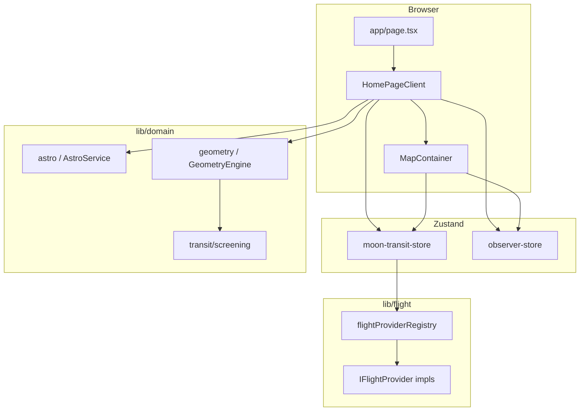

# Architecture — Moon Transit

This document explains how the application is structured, how data moves through it, and where to extend behavior without breaking assumptions.

## Goals (domain)

1. **Observer** — a fixed point on the ground (lat, lng, optional ground height). The moon’s apparent position and all geometry are computed for this point.
2. **Time** — a wall-clock anchor with a **simulated** offset on a **time-slider window**: after moonrise / moonset are known, the window is **visible-arc** (roughly rise→set) or 24h for circumpolar; otherwise a 12h **fallback**; `referenceEpochMs = timeAnchorMs + timeOffsetMs` is the “current simulation time”. Initial load and the **Sync** action clamp time and bump ephemeris refresh.
3. **Flights** — `FlightState[]` from a pluggable **flight provider** (Strategy pattern), loaded for the current map bounds.
4. **Transit / alignment** — compare moon azimuth with aircraft position (from altitude) to find “candidates” and “active” alignments within tolerance, plus photographer tools (line-of-sight rate, duration, suggested shutter).
5. **Map** — Mapbox GL: routes, **moon path** (visible window on map, dashed line + labels), moon azimuth ray, static-route intersections, flights as symbols, observer marker, **selected-aircraft stand** (cyan trapezoid + zero-offset spine for 3D line-of-sight at `referenceEpochMs`), optional “golden” UI when alignment is within a critical angle.

## High-level layout

- **UI shell** — `src/components/shell/HomePageClient.tsx` — sidebar (izvori, Mjesec, kandidati, tranziti) i alati (fotograf, kompas, polje); ispod `md` karta s `h-dvh` ispunjava srednji segment, kontrole u donjem „decku” s dva taba, jedna instanca mape. Na desktopu tri stupca kao prije. Map u drugom stupcu; map mora ostat **jedna** `MapContainer` instanca.
- **Map** — `src/components/map/MapContainer.tsx` — Mapbox, GeoJSON sources, **must** match store updates via effects (`loadFlightsInBounds` on move, etc.).

## State stores

### `useMoonTransitStore` (`src/stores/moon-transit-store.ts`)

| Field / action                                     | Role                                                                                                                                                                                                              |
| -------------------------------------------------- | ----------------------------------------------------------------------------------------------------------------------------------------------------------------------------------------------------------------- |
| `timeAnchorMs`, `timeOffsetMs`, `referenceEpochMs` | Ephemeris and screening use `referenceEpochMs` as the “current simulation time”. The slider is clamped to `getTimeSliderWindowMs(…, moonRise, moonSet, …)` when rise/set are known.                               |
| `moonRise`, `moonSet`, `moonRiseSetKind`           | Suncalc window for the time slider and moon-path clipping; from `AstroService.getMoonTimes` via `useAstronomySync`.                                                                                               |
| `ephemerisRefetchKey`                              | Bumped in `syncTimeToNow` so `useAstronomySync` re-fetches `getMoonTimes` for the UTC day of the **current** `referenceEpochMs` without re-running on every slider tick (avoids UTC-midnight desync on the path). |
| `setMoonRiseSet`                                   | Writes rise/set; may re-clamp `timeAnchorMs` / `referenceEpochMs` to the new window.                                                                                                                              |
| `mapView`                                          | Center, zoom, pitch, bearing — updated when the user pans the map.                                                                                                                                                |
| `flightProvider`                                   | `mock` / `static` / `openSky` (see `FlightProviderId`).                                                                                                                                                           |
| `flights`                                          | Last loaded snapshot; **not** real-time until next bounds load.                                                                                                                                                   |
| `selectedFlightId`                                 | Drives photographer tools, list highlighting, and the **stand** overlay on the map.                                                                                                                               |
| `openSkyLatencySkewMs`                             | Manual time skew for display extrapolation (field section).                                                                                                                                                       |
| `syncTimeToNow`                                    | “Sync” and initial shell layout: reset simulated time to now (clamped), bump `ephemerisRefetchKey`.                                                                                                               |
| `loadFlightsInBounds`                              | Invokes the active `IFlightProvider` and sets `flights` / `error` / `isLoading`.                                                                                                                                  |

**Design note (bounded context):** The store combines **simulated time**, **map view state**, and **flight loading + selection** in one Zustand slice. This is an **intentional aggregate** for a small app: a single `loadFlightsInBounds` can depend on time and provider without cross-store sync. A future split into `timeStore` / `flightsStore` / `mapViewStore` is optional; see `src/stores/README.md` (Croatian summary), `documentation/optimization-and-refactoring.md`, and `documentation/technicalconventions.md` (State + feature checklist) for the refactor log, trade-offs, and where to add new behavior.

### `useObserverStore` (`src/stores/observer-store.ts`)

| Field / action           | Role                                                                                           |
| ------------------------ | ---------------------------------------------------------------------------------------------- |
| `observer`               | `{ lat, lng, groundHeightMeters }` — default near Zagreb; can be GPS or “set from map center”. |
| `observerLocationLocked` | When true, user cannot accidentally move the observer.                                         |
| `mapFocusNonce`          | Incremented to ask `MapContainer` to `flyTo` the observer.                                     |

**Rule:** All moon/plane relative math should use `observer` from this store, not the map’s internal center, unless the feature explicitly is “set observer from view”.

## Flight providers (Strategy)

- **Interface:** `src/types/flight-provider.ts` — `IFlightProvider`: `getFlightsInBounds(FlightQuery)`, optional `getRouteLineFeatures`, `getRouteCorridorStats`.
- **Registry:** `src/lib/flight/flightProviderRegistry.ts` — single cached instance per `FlightProviderId`.
- **Implementations:**
  - `mockFlightProvider` — minimal test data.
  - `staticFlightProvider` — `routes.json` + `staticRoutePointAndBearing` for position/track along a segment.
  - `openSkyFlightProvider` — fetches via `GET /api/opensky/states?...` (bounds), parses states in `parseOpenSkyStates.ts`.

Adding a new source: implement `IFlightProvider`, register in the registry, add the id to `FLIGHT_PROVIDER_IDS` and the sidebar selector.

## Domain layer

- `**lib/domain/astro/`** — `AstroService.getMoonState` wraps moon ephemeris (suncalc-based helpers in `moon.ts`) → `MoonState` (azimuth, altitude, apparent radius, …). `**getMoonTimes**` (suncalc) → `moonRise` / `moonSet` / circumpolar kind in the store, updated by `**useAstronomySync**` (re-fetch on observer change and when `ephemerisRefetchKey` bumps in `syncTimeToNow` — *not* on every slider change; avoids swapping the suncalc UTC day at UTC midnight and desyncing the time-slider / moon path). `**getMoonPathSamples*`* and `**getMoonPathMapSpec**` use the **visible** time window (see `getTimeSliderWindowMs`, `useMapMoonOverlayFeatures`). `**MoonPathSample`** in `src/types/moon.ts`.
- `**lib/domain/geometry/**` — WGS84 helpers, ENU, horizontal line-of-sight (`horizontalToPoint` for 3D azimuth to the aircraft with altitude), moon azimuth line vs static routes, `**buildMoonPathLineCoordinates**` (ground points along a fixed-length ray per sample azimuth) for a moon-path `LineString`, **stand corridor** in `standCorridorQuads.ts` (trapezoid + spine; axis = back-azimuth of horizontal LoS from sub-aircraft point), **photographer** pack (angular rate, slant range, alignment time) in `GeometryEngine` / `lineOfSightKinematics` / `alignmentHint`.
- `**lib/domain/transit/screening.ts`** — Narrows which flights are worth listing as “candidates”.

Keep **pure functions** in `lib/domain` (no React, no `window` except where a module is explicitly “browser”).

## Extrapolation and latency

- `**extrapolateFlightForDisplay`** — Moves the aircraft along **track** for a short time (seconds) for smooth map display. If `trackDeg` is null, returns the state unchanged (no guess direction).
- **OpenSky skew** — `openSkyLatencySkewMs` is added to the “wall time” when extrapolating, so the user can line up ADS-B delay vs reality.

## API routes (Next.js)

- `**/api/opensky/states`** — Server-side `fetch` to `opensky-network.org` with `lamin, lomin, lamax, lomax` query params. Avoids CORS; returns JSON or 502 on upstream error. The **browser** must request this route with the app’s `basePath` prefix (via `appPath` in `OpenSkyFlightProvider`) when not hosted at `/`.

## Map rendering (Mapbox)

- **Sources** — `routes-geo`, `flights-geo`, `moon-azimuth-geo`, `moon-path-geo`, `moon-path-labels-geo`, `moon-intersections-geo`, `optimal-ground-geo`, `selected-stand-geo`, `selected-stand-spine-geo` (source ids: `src/lib/map/mapSourceIds.ts`; registration: `registerMoonTransitLayers` in `src/lib/map/registerMoonTransitLayers.ts`; GeoJSON updates: `useMapGeoJsonSync`). **Moon path** — dashed `LineString` in the **visible** ephemeris window; symbol layer for time labels. **Selected aircraft** — when `selectedFlightId` is set, one **stand** trapezoid (current simulated instant, extrapolated position) and a **spine** `LineString` on `selected-stand-spine-geo` (3D line-of-sight–based axis, high-contrast); see `useSelectedAircraftStandCorridorFeatures` and `standCorridorQuads`. **Ray length for the path** is shorter than the long moon–route intersection azimuth so the curve stays in a useful map scale. Data follows `referenceEpochMs` and `observer` (same as the simulated time controls).
- **Flights** — Symbol layer with an SVG **plane** icon; rotation from `trackDeg` in feature properties. Fallback circle layer if icon creation fails; layer is `moveLayer`d to the top so it stays **above** stand and other GeoJSON overlays.
- **Observer** — `mapboxgl.Marker` with a custom DOM (camera), not a GeoJSON point.

**Performance:** `loadFlightsInBounds` runs on map move end; don’t add synchronous heavy work in the main map thread without debounce.

## Field / export

- `**lib/field/fieldPlanExport.ts`** — Plain-text “cheat sheet” and a simple PNG (canvas) derived from a snapshot; triggered from the field section in the shell.

## Extension points (checklist for new features)

1. **New flight source** — New `IFlightProvider` + registry + `FLIGHT_PROVIDER_IDS`.
2. **New geometry** — Prefer `lib/domain/geometry` + types in `src/types`.
3. **New UI in sidebar** — `HomePageClient.tsx` composes panel components under `src/components/shell/panels/`; orchestration is in `useHomeShellOrchestration`.
4. **Map layers** — `registerMoonTransitLayers` + `MapContainer` / `useMoonTransitMap` / `useMapGeoJsonSync` so layer setup and `setData` wiring stay explicit and testable in isolation from JSX.

## Deployment and `basePath` (self-host)

- When the app is served under a subpath (e.g. cPanel: `https://host/LunaPic`), a single `cpanelBasePath.cjs` + `server.js` and `appPath` for client fetches and `public` URLs apply; see [deployment-cpanel.md](deployment-cpanel.md). The OpenSky client uses `appPath` so `GET` hits `/LunaPic/api/opensky/…` instead of the domain root.

## Quality assurance (tests, CI, field profiling)

- **Unit tests** — [Vitest](https://vitest.dev/) 3, `src/lib/domain/**/*.test.ts` and `src/lib/perf/fieldPerf.test.ts`. See `documentation/technicalconventions.md` (Testing) for commands.
- **E2E** — Playwright: `e2e/smoke.spec.ts`, `e2e/flight-source.spec.ts`. Requires `npm run build` before `npx playwright test` (see `playwright.config.ts` `webServer`).
- **CI** — `[.github/workflows/ci.yml](../.github/workflows/ci.yml)`: `npm ci` → `npm audit` → `lint` → `tsc` → Vitest → `build` → Playwright (Chromium install on the runner). Full detail: `documentation/technicalconventions.md`.
- **Field / map profiling** (optional) — `documentation/performance.md`, `src/lib/perf/fieldPerf.ts`, in-map `FieldPerfOverlay` when `NEXT_PUBLIC_FIELD_PERF=1` or `localStorage` key `moonTransitFieldPerf`.

## Known limitations (intentional or technical)

- **Flights** are a **snapshot** per bounds load, not a streaming socket.
- **Time slider** does not re-fetch history from OpenSky; it updates `referenceEpochMs` in the current rise/set (or fallback) window and uses the same flight snapshot (documented in UI for OpenSky use). **Suncalc** `moonRise` / `moonSet` re-fetch in `**useAstronomySync`** is tied to **Sync** and **observer** changes (`ephemerisRefetchKey`), not to every move of the slider, so a UTC day boundary during scrubbing does not replace rise/set and break the moon path window.
- **Compass** uses device orientation where available; accuracy varies by device and environment.

## Related files

- App entry: `src/app/page.tsx`, `src/app/layout.tsx`
- Human docs: `README.md` (root), `documentation/README.md` (index), `documentation/deployment-cpanel.md` (cPanel / sub-URL), `documentation/performance.md` (field runtime perf)
- Map token: `NEXT_PUBLIC_MAPBOX_TOKEN`
- Route data: `src/data/routes.json`, `src/data/staticRouteUtils.ts`

