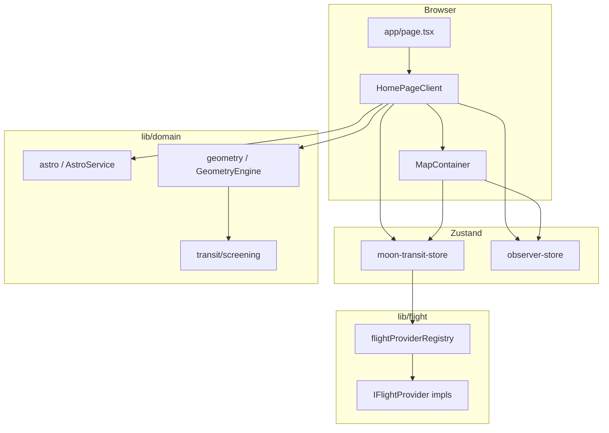

# Architecture — LunaPic

This document explains how the application is structured, how data moves through it, and where to extend behavior without breaking assumptions.

## Goals (domain)

1. **Observer** — a fixed point on the ground (lat, lng, optional ground height). The moon’s apparent position and all geometry are computed for this point.
2. **Time** — **Sync** sets `timeAnchorMs` to wall-clock **now**; the slider scrubs **forward** by `timeOffsetMs` up to a **civil day** (~24 h): `referenceEpochMs = timeAnchorMs + timeOffsetMs` is the “current simulation time”. **Moonrise / moonset** from `AstroService.getMoonTimes` drive ephemeris UI and which **map moon-path arc** is drawn as the primary (visible) segment; they do not define the slider extent. **Sync** bumps ephemeris refresh; crossing a **UTC calendar day** while scrubbing also bumps so rise/set stay aligned with `referenceEpochMs`.
3. **Flights** — `FlightState[]` from a pluggable **flight provider** (Strategy pattern), loaded for the current map bounds.
4. **Transit / alignment** — compare moon azimuth with aircraft position (from altitude) to find “candidates” and “active” alignments within tolerance, plus photographer tools (line-of-sight rate, duration, suggested shutter).
5. **Map** — Mapbox GL: routes, **moon path** (primary dashed arc for the visible rise→set window when known, plus a **low-contrast full-day** path for the whole UTC day), **simulated-instant marker** on the path, **moon azimuth** at `referenceEpochMs`, optional **NOW** wall-clock moon pointer (cyan), static-route intersections, flights as either a **3D model layer** (airplane glTF), a lightweight **ATC-style** 2D overlay, or a **VFR Map** raster overlay (`mapDisplayMode`, see *Map aircraft display mode* below), observer marker (`anchor: “center”` — coordinate maps to visual icon centre so spine lines attach correctly), global **raster DEM** for `queryTerrainElevation` (observer **ground height** when the browser does not supply GNSS altitude or when the user places the observer on the map), **selected-aircraft stand** (cyan footprint + zero-offset spine originating from observer + 3D volume, rendered only when aircraft azimuth is within ±25° of moon azimuth — otherwise hidden as semantically meaningless), observer-centric **transit opportunity corridor** rendered by **`CorridorVolumeCustomLayer`** (WebGL `CustomLayer` with `depthMask(false)` during render — green LOW/MEDIUM/HIGH confidence bands + top face, shown only when moon field visibility is **Optimal**; aircraft models added after the custom layer always win the depth test), short **selected-flight trajectory** with altitude-aware 3D offset when an aircraft is picked, optional “golden” UI when alignment is within a critical angle. All 3D vertical distances use **1:1 real-metre world-space scale** (`model-translation Z`, `CorridorVolumeCustomLayer.ALTITUDE_SCALE = 1.0`, `fill-extrusion-height`) so vertical proportions match the map's horizontal distances.

## High-level layout


```mermaid
flowchart TB
  subgraph client [Browser]
    Page[app/page.tsx]
    Shell[HomePageClient]
    Map[MapContainer]
    Page --> Shell
    Shell --> Map
  end

  subgraph state [Zustand]
    MTS[moon-transit-store]
    OBS[observer-store]
  end

  subgraph domain [lib/domain]
    Astro[astro / AstroService]
    Geo[geometry / GeometryEngine]
    Screen[transit/screening]
  end

  subgraph flight [lib/flight]
    Reg[flightProviderRegistry]
    Prov[IFlightProvider impls]
  end

  Shell --> MTS
  Shell --> OBS
  Map --> MTS
  Map --> OBS
  MTS --> Reg
  Reg --> Prov
  Shell --> Astro
  Shell --> Geo
  Geo --> Screen
```


- **UI shell** — `src/components/shell/HomePageClient.tsx` — mapa zauzima cijeli viewport (`absolute inset-0`); sav UI lebdi iznad nje kao glass overlay. **Header** je `<header>` element (`absolute inset-x-0 top-0`, `height: calc(3.5rem + env(safe-area-inset-top))`), jednak na desktopu i mobileu: sadrži `BrandPill` (logo + tekst, bez glass pozadine), `CommandBar` (search, transparentni inner pill), `WeatherOverlay`, separator, i tri akcijska gumba — **Use my GPS** (emerald, spinner dok se traži lokacija), **Set my location here** (amber), **Focus on me** (sky). Na desktopu desno od searcha dolazi `TopRightCluster`; na mobileu gumbi su inline u istom redu, a stack se sakriva (`opacity-0`) kad je sheet ili popup otvoren. Ispod headera na desktopu stoji `FloatingRail` (ikone → drawer s panelon); na mobileu `MobileDock` (tab bar) + `MobileSheet` (bottom sheet, snap peek/half/full). `TimeRibbon` je pill pri dnu ekrana (kompaktna verzija za mobile, puna za desktop). Jedna instanca `MapContainer`. **Floating alerts:** two independent dismiss-able overlay cards appear above the map when relevant: `IncomingTransitAlert` (emerald, `z-[18]`) fires when `activeTransits.length > 0` — aircraft on the moon ray — and opens the Active panel; `GreenZoneAlert` (amber, `z-[17]`) fires when `computeShotFeasibleFlightIds` returns a non-empty set — aircraft within geometric overlap *and* camera optical range — and opens the Photo panel. Both use the same derived-state dismiss pattern: a `dismissedAtCount` / `greenDismissedAtCount` local state that suppresses the alert only while the count matches the value at dismissal; any count change re-shows it. Desktop positions are `right-[6.5rem] bottom-[10rem]` / `right-[6.5rem] bottom-[16rem]`; mobile uses `left-2 right-2` with stacked top offsets.
- **Transit alert system (two-sided: client UX + server-owned push)** — detection logic lives in pure functions `computeTransitCandidates` / `computeActiveTransits` (`src/lib/domain/transit/`), the single source of pipeline thresholds, shared by both the client hooks (`useTransitCandidates` / `useActiveTransits`, thin selectors over the shared `useTransitComputedStore` — see [Shared transit computation](#shared-transit-computation-dedup) below) and the server scan route. See [Server-side transit scan](#server-side-transit-scan-background-push) below for the server path.
  - **Client (in-app UX only).** `useCandidateAlerts` compares the current `candidatesDisplay` (`willTransit: true` only) and `activeTransits` arrays against refs of previously seen flight IDs and, on a new flight while the tab is visible, plays `playTransitCandidateAlert()` / `playActiveTransitAlert()` and sets `latestAlert` for `TransitAlertToast`. Per-flight cooldown: 2 minutes. **The client no longer sends push** (the old `document.hidden → POST /api/push/send` branch was removed) — the server owns all notifications, so there are no duplicate alerts. `TransitAlertToast` is a fixed glass banner (mobile: near altitude bar at top; desktop: above timeline ribbon at bottom); clickable body selects the aircraft, ✕ button dismisses, auto-dismiss after 8 s.
  - **Subscription registration.** `usePushRegistration` registers `public/sw.js` as a Service Worker and calls `pushManager.subscribe()` from user-gesture click handlers (required on iOS); non-iOS auto-subscribes from a `useEffect`. The subscribe POST now carries the device's **observer location + camera** (focal length, sensor) so the server can run detection per device; a debounced effect re-upserts the subscription when observer/camera change, and toggling alerts off `DELETE`s the subscription. Subscriptions stored in `data/push-subscriptions.json` (record now optionally holds `observer` + `camera`; legacy records without `observer` are skipped by the server scan).
  - **Prompt & toggle.** `NotificationPermissionPrompt` appears after 2 s on first load if push is supported and permission is `"default"`; "Not now" snoozes 3 days (`moonTransitNotifSnoozeUntilMs` in localStorage); "Don't ask again" sets `moonTransitNotifNeverAsk=1`. **Toggle:** bell icon in `TransitCandidatesPanel` header controls `s.alertsEnabled`; first enable calls `subscribeToPush()` from the click handler (iOS-safe).
  - **ATC radio sounds (client only).** `playTransitCandidateAlert` = squelch burst + 1000 Hz bandpass-filtered beep; `playActiveTransitAlert` = squelch + double 1200 Hz beep. Custom sounds: drop `candidate-alert.mp3` / `active-transit-alert.mp3` in `public/sounds/` — loaded and cached on first play, synthesis used as fallback.
  - **iOS limitation:** Web Push only works for a PWA added to the Home Screen (iOS 16.4+); iOS ignores the notification `vibrate` pattern and custom sound (uses the system notification sound).
- **Map** — `src/components/map/MapContainer.tsx` — Mapbox, GeoJSON sources, **must** match store updates via effects (`loadFlightsInBounds` on move, etc.). Receives `**fieldSoundsEnabled`** from the shell when **Field sounds** are on: `useTransitFieldSounds` plays a **chime** when the **selected** aircraft enters the **green** (shot-feasible) set (`computeShotFeasibleFlightIds`, same rules as map tint) and a **soft hold tone** while it stays in the **moon-overlap** disc model (`screenTransitCandidates`); short tones live in `src/lib/audio/fieldAudio.ts` using a **shared `AudioContext`** primed from a **user tap** (`primeFieldAudioFromUserGesture` on **Sounds on**, `resumeSharedAudioFromUserGesture` on **Sync** — needed on iOS Safari before effect-driven audio). Countdown **beeps** (≈3 s before alignment and at alignment) remain in `useTransitBeep` (`useHomeShellOrchestration` + `usePhotographerTools`).

## State stores

### `useMoonTransitStore` (`src/stores/moon-transit-store.ts`)


| Field / action                                                | Role                                                                                                                                                                                                                                                                                                                                                                                                                                                                       |
| ------------------------------------------------------------- | -------------------------------------------------------------------------------------------------------------------------------------------------------------------------------------------------------------------------------------------------------------------------------------------------------------------------------------------------------------------------------------------------------------------------------------------------------------------------- |
| `timeAnchorMs`, `timeOffsetMs`, `referenceEpochMs`            | Ephemeris and screening use `referenceEpochMs` as the “current simulation time”. `**getTimeSliderWindowMs`** returns `[timeAnchorMs, timeAnchorMs + 24h)` (civil day forward from the last **Sync**); `timeAnchorMs` does not move when scrubbing.                                                                                                                                                                                                                         |
| `moonRise`, `moonSet`, `moonRiseSetKind`                      | Rise/set for ephemeris panels and for **which segment** of the day is highlighted as the primary **visible** moon path on the map; **not** the slider extent. From `AstroService.getMoonTimes` via `useAstronomySync`.                                                                                                                                                                                                                                                     |
| `ephemerisRefetchKey`                                         | Bumped in `syncTimeToNow` and when `setTimeOffsetMs` crosses a **UTC calendar day** so `useAstronomySync` re-fetches `getMoonTimes` for the simulated day; not on every slider step within the same UTC day.                                                                                                                                                                                                                                                               |
| `setMoonRiseSet`                                              | Writes rise/set; re-clamps `referenceEpochMs` / `timeOffsetMs` into `[timeAnchorMs, timeAnchorMs+24h)` when the anchor is set.                                                                                                                                                                                                                                                                                                                                             |
| `mapView`                                                     | Center, zoom, pitch, bearing — updated when the user pans the map.                                                                                                                                                                                                                                                                                                                                                                                                         |
| `flightProvider`                                              | `mock` / `static` / `opensky` / `adsbone` (see `FlightProviderId`). **Default:** `opensky`. When both live REST feeds are enabled, `flightProvider` stays `**opensky`** for corridor / debounce while `**liveFlightFeeds**` tracks the mask.                                                                                                                                                                                                                               |
| `liveFlightFeeds`                                             | `{ opensky, adsbone, localsdr }` booleans — **live mode only** (checkboxes in **Flight source** panel). **Default:** `opensky: true, adsbone: true, localsdr: false`. At least one must stay on. `localsdr` can be on alone (SDR-only mode) or combined with web sources. Same **ICAO24** is merged into one `FlightState` (`mergeLiveFlightLists.ts`, `mergeLiveFlightListsWithSdrPriority` when localsdr active).
| `providerFlightCounts`                                        | `{ opensky: number, adsbone: number, localsdr: number }` — raw aircraft count per provider after the last successful fetch (before merging). Displayed in the Flight source panel as `(n)` next to each source label.                                                                                                                                                                                   |
| `flights`                                                     | Last loaded snapshot; **not** real-time until next bounds load.                                                                                                                                                                                                                                                                                                                                                                                                            |
| `selectedFlightId`                                            | Drives photographer tools, list highlighting, and the **stand** overlay on the map.                                                                                                                                                                                                                                                                                                                                                                                        |
| `openSkyLatencySkewMs`                                        | Manual time skew for display extrapolation (field section).                                                                                                                                                                                                                                                                                                                                                                                                                |
| `cameraFocalLengthMm`, `cameraSensorType`                     | Photographer optical setup (default **600 mm**, **full frame**). Crop factors: `**fullFrame` 1.0×**, `**apsC` 1.5×**, `**apsC16` 1.6×** (typical Canon APS-C), `**microFourThirds` 2.0×**. Drives shot-feasibility, map feasible tint, corridors, and viewfinder effective focal.                                                                                                                                                                                          |
| `cameraPresetId`, `cameraFrameWidthPx`, `cameraFrameHeightPx` | **Preset** (`CameraPresetSelect`): fixed bodies from `src/lib/camera/cameraPresets.ts` apply **sensor + output resolution**; `**other`** lets the user pick **sensor** and **frame width/height** (px). Store holds the active output size for **Shot feasibility** copy and `**ViewfinderPreview`** scale labels (initially **6000×4000** until a preset overrides it).                                                                                                   |
| `syncTimeToNow`                                               | “Sync” and initial shell layout: `timeAnchorMs` = now, `timeOffsetMs` = 0, `referenceEpochMs` = now; bump `ephemerisRefetchKey`.                                                                                                                                                                                                                                                                                                                                           |
| `loadFlightsInBounds`                                         | For **static/mock**, one `IFlightProvider`. For **live**, `Promise.allSettled` over each enabled id, then `**mergeLiveFlightLists`** when both succeed, then `**mergeFlightsWithOpenSkyRetention**` (after `**mergeStickyFlightMetadata**`) — for `**opensky**` / `**adsbone**` / dual keeps short-lived feed gaps smoother on mobile; clears retention when `**setFlightProvider**` or `**setLiveFlightFeeds**` changes the mask. Sets `flights` / `error` / `isLoading`. |
| `altitudeBandIndex`, `setAltitudeBandIndex`                   | `0` = **All** (no band filter); `1–6` = filter `filteredFlights` to the matching `ALTITUDE_BANDS` entry (by `geoAltitudeMeters`). Shared between `MapContainer` (flight filtering), `FlightAltitudeLegend` (slider + tooltip), and `useMapGeoJsonSync` (`contrailBadgeVisible`). Default `0`.                                                                                                                                                                                                                              |
| `flightAltitudeLegendUnit`, `setFlightAltitudeLegendUnit`     | `"ft"` (default) or `"km"` — controls the **tick labels** under the `FlightAltitudeLegend` gradient bar. Does not affect color logic.                                                                                                                                                                                                                                                                                                                                     |
| `mapDisplayMode`, `setMapDisplayMode`                         | `**default**` (UI: **3D Model**) vs `**atc**` (**ATC Style**) vs `**vfr**` (**VFR Map**). Drives `useMapDisplayMode`, visibility of the 3D flight layer vs ATC GeoJSON layers vs OpenAIP raster overlay + border mask. Stored in `**types/map-display.ts`**.                                                                                                                                                                                                          |
| `patchFlightAircraftTypeFromIndex`                            | Writes `**aircraftType**` on a single `FlightState` from the OpenSky aircraft index when the label was empty (idempotent if type already set). Used by `**SelectedAircraftMapPopup**` on selection and by `**useFlightAircraftTypeIndexPrefetch**` for background fill.                                                                                                                                                                                                    |
| `pruneFlightsToObserverRadius(lat, lng, radiusKm)`            | Immediately filters `flights` to only those within `radiusKm` of the given point (haversine distance). Called synchronously in `useMoonTransitMap` when the observer position changes, before the debounced API refresh — ensures aircraft from the previous location disappear instantly rather than lingering for up to 32 s (the retention window).                                                                                                                       |


**Design note (bounded context):** The store combines **simulated time**, **map view state**, and **flight loading + selection** in one Zustand slice. This is an **intentional aggregate** for a small app: a single `loadFlightsInBounds` can depend on time and provider without cross-store sync. A future split into `timeStore` / `flightsStore` / `mapViewStore` is optional; see `src/stores/README.md` (Croatian summary), `documentation/optimization-and-refactoring.md`, and `documentation/technicalconventions.md` (State + feature checklist) for the refactor log, trade-offs, and where to add new behavior.

### `useObserverStore` (`src/stores/observer-store.ts`)


| Field / action                   | Role                                                                                                                                                                                                                   |
| -------------------------------- | ---------------------------------------------------------------------------------------------------------------------------------------------------------------------------------------------------------------------- |
| `observer`                       | `{ lat, lng, groundHeightMeters }` — default **balcony** point in Zagreb (**45.82968°N, 16.06368°E**, 130 m); position from GPS, draggable marker, or “set from map center”.                                           |
| `observerLocationLocked`         | When true, user cannot accidentally move the observer.                                                                                                                                                                 |
| `mapFocusNonce`                  | Incremented to ask `MapContainer` to `flyTo` the observer.                                                                                                                                                             |
| `placeObserverFromViewNonce`     | Bumps when the UI asks to copy the **map viewport center** into `observer` (`useMoonTransitMap`).                                                                                                                      |
| `terrainGroundHeightSyncNonce`   | Bumps after a **GPS** fix when the browser omits `**coords.altitude`** — `useMoonTransitMap` re-samples Mapbox DEM once the style is ready (avoids leaving `groundHeightMeters` at 0 until the user moves the marker). |
| `requestTerrainGroundHeightSync` | Action: increment `terrainGroundHeightSyncNonce` (used from `useGpsObserver`).                                                                                                                                         |


**Rule:** All moon/plane relative math should use `observer` from this store, not the map’s internal center, unless the feature explicitly is “set observer from view”.

**Observer ground height (`groundHeightMeters`):** `**registerMoonTransitLayers`** calls `**ensureMapboxTerrain**` (`src/lib/map/mapboxTerrainElevation.ts`) to add `**mapbox://mapbox.mapbox-terrain-dem-v1**` and `**setTerrain**`. `**useMoonTransitMap**` uses `**queryTerrainElevation(..., { exaggerated: false })**` after: first layer registration, **set observer from map center**, **marker drag end**, and when `**terrainGroundHeightSyncNonce`** changes (post-GPS without altitude). That yields a **terrain-model elevation** (Mapbox DEM, ~mean sea level — not identical to WGS84 ellipsoid). When `**navigator.geolocation`** provides `**coords.altitude**`, `**useGpsObserver**` stores it and **does not** request a terrain overwrite. See `**GroundObserver`** in `src/types/geo.ts`.

### Shared transit computation (dedup)

`src/stores/transit-computed-store.ts` (`useTransitComputedStore`) — a third, **derived** store: `{ moon, candidates, activeTransits }`. It does not own input state (that stays in `useMoonTransitStore` / `useObserverStore`); it caches the *output* of the transit pipeline so it is computed once per tick instead of once per consuming component.

- **Writer:** `src/hooks/useSharedTransitComputation.ts` — the only place that ticks `useWallNowMs(250)` and calls `AstroService.getMoonState` / `computeTransitCandidates` / `computeActiveTransits`. Mounted exactly **once**, from `useHomeShellOrchestration` (itself mounted once in `HomePageClient`). Writes the result into `useTransitComputedStore` via `useLayoutEffect` (before paint, so there is no visible flash of stale data on mount).
- **Readers:** `useMoonStateComputed`, `useTransitCandidates` (`src/hooks/useTransitCandidates.ts`), `useActiveTransits` (`src/hooks/useActiveTransits.ts`) are now thin Zustand selectors over `useTransitComputedStore` — no `useMemo`, no `useWallNowMs` of their own. `useActiveTransits()` no longer takes a `toleranceDeg` argument; the only caller always passed the default (`DEFAULT_ACTIVE_TRANSIT_TOL_DEG` = 0.5°), so the parameter was dropped rather than kept as unused flexibility. If a future caller needs a different tolerance, either extend the shared store or compute that one instance separately — do not reintroduce per-component duplication.
- **Why (2026-07-22):** before this, `useMoonStateComputed` ran independently in `MapContainer`, `FieldOverlaysSection`, `CompassAimPanel`, and `useHomeShellOrchestration` (4 separate `useWallNowMs` ticks + 4 separate `AstroService.getMoonState` calls), and `useTransitCandidates` / `useActiveTransits` each ran their own full pipeline (screening + `photographerPack` per candidate) over the entire `flights` array in `useHomeShellOrchestration` **and** `ArSkyCameraPanel` (`useTransitCandidates`) — all on independent 250 ms ticks, continuously, whenever the app was open, regardless of which panels were actually visible. Combined with Mapbox WebGL re-rendering, this was heavy enough to spin up fans on a desktop machine. Consolidating to one tick + one computation, read via selectors, removes the duplication without changing tick rate or pipeline thresholds — see `documentation/optimization-and-refactoring.md` §8 for the before/after and `documentation/performance.md` for how to re-profile.
- **Coupling to watch:** any component reading these hooks must live under `HomePageClient` (where `useHomeShellOrchestration` — and therefore the writer — is mounted), otherwise `useTransitComputedStore` never updates past its static initial value (default Zagreb observer, computed at module import time). Confirmed true today: `MapContainer` and every consumer of these hooks render exclusively inside `HomePageClient`'s tree.

## Flight providers (Strategy)

- **Interface:** `src/types/flight-provider.ts` — `IFlightProvider`: `getFlightsInBounds(FlightQuery)`, optional `getRouteLineFeatures`, `getRouteCorridorStats`.
- **Registry:** `src/lib/flight/flightProviderRegistry.ts` — single cached instance per `FlightProviderId`.
- **Implementations:**
  - `mockFlightProvider` — minimal test data.
  - `staticFlightProvider` — `routes.json` + `staticRoutePointAndBearing` for position/track along a segment.
  - `openSkyFlightProvider` — fetches via `GET /api/opensky/states?...` (bbox). **Fetch region:** inside the static `routes.json` hull the bbox is **hull ∩ observer disk** (~100 km radius); **outside** that hull the bbox is the **observer disk alone** so relocation (e.g. another country) still loads local ADS-B. **Client filter** for which states become `FlightState[]`: always `**union(map viewport bounds, observer disk)`** — avoids dropping aircraft that are still in the API box but slightly off the current viewport edge. Parses in `parseOpenSkyStates.ts`; server-side bbox caching remains in the provider (`CACHE_MS`).
  - `adsbOneFlightProvider` — **Proxy-first** same-origin `**GET /api/adsbone/point`** (`fetchAdsbOneUpstream.ts`) to avoid browser CORS failures on origins not whitelisted by `api.adsb.one`. Optional browser-direct fallback exists only when explicitly enabled (`NEXT_PUBLIC_ADSBONE_ALLOW_DIRECT=1`, debug/special deployments). **Same fetch geometry** as OpenSky (`openSkyStyleQueryRegion.ts`); client filter `**union(viewport, observer disk)`**; parser `parseAdsbOnePoint.ts`.
  - `localSdrFlightProvider` (`src/lib/flight/providers/localSdrFlightProvider.ts`) — **Local ADS-B receiver** (dump1090 / readsb on a Raspberry Pi). Fetches via `GET /api/localsdr/aircraft` (same-origin proxy, `appPath()` required). Parses `aircraft.json` format from readsb: `hex` → ICAO24, `flight` → callsign, `alt_baro`/`alt_geom` (feet → metres), `gs` (knots → m/s), `track`, `t` (ICAO type code). Aircraft with `alt_baro: "ground"` get 0 m. Only aircraft with valid `lat`/`lon` and `seen_pos < 60 s` are returned. 3-second client-side cache; load-chain serialisation prevents parallel fetches. Parser: `src/lib/flight/localsdr/parseLocalSdrAircraft.ts`. API route: `src/app/api/localsdr/aircraft/route.ts` — server-side proxy to `LOCAL_SDR_URL` env var; requires `export const dynamic = "force-dynamic"` to prevent Next.js build-time static caching. **Credential handling:** Web Fetch API rejects URLs with embedded `user:pass@host` credentials — `parseSdrUrl()` in the route extracts username/password from the URL, strips them, and sends `Authorization: Basic <base64>` header; `LOCAL_SDR_URL` may safely include credentials. **10 s in-memory cache** in the route handler protects the Pi from concurrent client requests (all clients within a 10 s window share one upstream response). **Rate limit:** 20 req/60 s per IP. **SDR priority merge:** when both localsdr and web sources are active, `mergeLiveFlightListsWithSdrPriority` lets the Pi win geometry for aircraft it sees, while web sources fill metadata (airline, type). **No retention** for localsdr: `mergeFlightsWithOpenSkyRetention` exits early when `providerId === "localsdr"`, so aircraft disappear immediately when the Pi stops seeing them. **Production access:** Pi is behind home NAT; nginx on the Pi (port 80) enforces HTTP basic auth and proxies to lighttpd/tar1090 (port 8080); Tailscale Funnel exposes nginx publicly via `https://<node>.<tailnet>.ts.net` — set `LOCAL_SDR_URL=https://user:pass@<node>.<tailnet>.ts.net/tar1090/data/aircraft.json` in cPanel environment variables (see `deployment-cpanel.md`).

**Aircraft type by ICAO24 (not from live state vectors):** OpenSky `**/states`** and ADS-B One point payloads expose **ICAO24** and (when present) **emitter category**, but not a reliable **ICAO type designator / manufacturer / model** string for the airframe. The app therefore keeps a **static, sharded JSON index** under `**public/data/opensky-aircraft/{prefix}.json`** (prefix = first **three** hex chars of ICAO24), built offline from OpenSky’s **aircraft metadata** CSV via `**npm run data:opensky-aircraft`** (`scripts/build-opensky-aircraft-index.mjs` → source ZIP on [OpenSky datasets](https://opensky-network.org/datasets/metadata/)). At runtime, `**openskyAircraftIndexClient.ts**` fetches only the needed shard; `**SelectedAircraftMapPopup**` still lazy-loads a label when `**aircraftType**` is empty on the selected flight. Additionally, `**useFlightAircraftTypeIndexPrefetch**` (from `**HomePageClient**`) prefetches labels for visible flights missing a type (debounced, bounded concurrency) so sidebar **Filter → aircraft type** options are useful without clicking the map first. `**patchFlightAircraftTypeFromIndex`** writes labels into `**moon-transit-store**` so `**mergeStickyFlightMetadata**` can retain them across refreshes. `**appPath**` applies to shard URLs when `**basePath**` is set. Regenerate and commit the folder when updating the snapshot.

**Not the same as other flight apps:** Live modes use **OpenSky** and/or **ADS-B One** (this app’s bbox / filters), not FlightRadar24. Any third-party map can still show aircraft your chosen feed did not return for that instant (different receivers, MLAT, partners).

Adding a new source: implement `IFlightProvider`, register in the registry, add the id to `**FLIGHT_PROVIDER_IDS`**, and if it should appear in the shell combobox, add it to `**FLIGHT_PROVIDER_COMBO_IDS**` (today: `**opensky**`, `**adsbone**`, `**localsdr**` — each as a checkbox row; localsdr has a visual separator above it and shows `↑ priority` badge when active).

## Domain layer

- `**lib/domain/astro/`** — `AstroService.getMoonState` wraps moon ephemeris (`moon.ts`) → `MoonState` (azimuth, altitude, apparent radius, …). **Ephemeris library:** `astronomy-engine` v2.1.19 (USNO-grade, <1 arcminute accuracy). `moon.ts` `getMoonState()` uses `Astronomy.Equator()` + `Astronomy.Horizon()` with atmospheric refraction; phase and illumination use `Astronomy.MoonPhase()` and angular elongation. **Do not** call SunCalc for moon position or phase — use `AstroService` (see *Technical conventions*). `getMoonState` accepts a 4th argument `observerElevM` (metres, default `0`); callers must pass `observer.groundHeightMeters` so refraction is computed for the correct altitude. `**moonFieldVisibilityAdvice`** maps `altitudeDeg` to **Critical / Caution / Optimal** tiers for the **Moon (nowcast)** panel (field-visibility hints, not a weather forecast). `**MoonEphemerisPanel`** also derives an `illuminationAdvice` memo from `moon.illuminationFraction`: below 5 % (near new moon) a red *"Near new moon"* warning is shown; 5–20 % (thin crescent) shows an amber caution; ≥ 20 % shows nothing. This is rendered as a **Phase** row in the Visibility Advice section, alongside the existing elevation tier and cloud-cover rows. `**getMoonTimes`** → `moonRise` / `moonSet` / circumpolar kind in the store, updated by `**useAstronomySync**` when `ephemerisRefetchKey` bumps (**Sync**, **UTC day change** while scrubbing, **observer** move) — not on every slider step within the same UTC day. `**getMoonPathMapSpec`** still uses the **visible** rise/set window for the **primary** dashed moon path and its tick labels; a separate **full-day** sample strip uses the UTC calendar day. `**getTimeSliderWindowMs`** defines the slider span (**~24 h forward** from `timeAnchorMs`), distinct from the visible-arc path spec. See `useMapMoonOverlayFeatures`. `**MoonPathSample`** in `src/types/moon.ts`.
- `**lib/domain/geometry/`** — WGS84 helpers, ENU, horizontal line-of-sight (`horizontalToPoint` for 3D azimuth + elevation to the aircraft with altitude), moon azimuth line vs static routes, `**buildMoonPathLineCoordinates**` (ground points along a fixed-length ray per sample azimuth) for a moon-path `LineString`, **stand corridor** in `standCorridorQuads.ts` (trapezoid + spine; axis = back-azimuth of horizontal LoS from sub-aircraft point), **photographer pack** (angular rate, slant range, alignment time, **3D transit prediction**) in `GeometryEngine` / `lineOfSightKinematics` / `alignmentHint`, and **shot feasibility** in `shotFeasibility.ts`. `alignmentHint.ts` also exports `nudgeBearing(signedMoonToAcDeg, moonAzDeg)` — the correct field-navigation hint: the observer must walk **perpendicular to the Moon's ray** (`bearingDeg = moonAzDeg + 90° × sign(signedDiff)`) to shift the aircraft's apparent azimuth toward the Moon. Distance is approximated as `|signedDiff_deg| × 600 m` (no cosLat factor — the bearing is already in real-world compass space). This is distinct from the legacy `nudgeNorthSouthMeters` which was N/S only and applied an incorrect `1/cosLat` scaling.

  **3D transit prediction in `photographerPack` (`geometryEnginePhotographer.ts`):** After computing the ETA to azimuth alignment (`timeToAlignmentSec`), the function projects the aircraft's position forward to that future instant using `deadReckonPosition` (spherical-Earth great-circle dead reckoning; altitude assumed constant at cruise level). It fetches the moon state at that future time and returns: `willActuallyTransit` (`true` when `|elevationGapAtAlignmentDeg| ≤ moon apparent radius + aircraft angular radius`), `separationAtAlignmentDeg` (full 2D sky separation, kept for reference), `elevationGapAtAlignmentDeg` (signed aircraft−moon elevation, negative = aircraft passes below the moon), and `futureSlantMeters` (ECEF slant range observer→aircraft at the dead-reckoned position). **`willActuallyTransit` uses the elevation gap directly** — not the full 2D `sep` — because the linear azimuth alignment model diverges for large lookahead times (aircraft currently far from the moon in azimuth), causing `sep` to be inflated even when the elevation gap is small. The elevation-gap criterion was validated in real-world photography (2026-05-23). **This is the definitive filter**: azimuth alignment alone is not sufficient for a transit — the elevation must also match within the moon's apparent radius (~0.26°).

  **`sky-separation.ts`** — `angularSeparationDeg(a, b)`: great-circle distance on the celestial sphere between two `{ altitudeDeg, azimuthDeg }` pairs using the spherical law of cosines. Used by `screenTransitCandidates`, `useActiveTransits`, `useNearestTransitWindow`, and `photographerPack`.

- `**lib/domain/transit/screening.ts`** — Narrows which flights are worth listing as “candidates”. Uses `angularSeparationDeg` (full 2D sky separation) to rank and threshold candidates — **not** azimuth-only. Three hard filters are applied before a flight enters the output list: (1) **altitude known** — flights without a geometric or barometric altitude are skipped; (2) **slant range ≤ 100 km** (`MAX_SLANT_RANGE_METERS = 100_000`) — matches the photographable limit shown as the observer radius ring; (3) **converging trajectory** — the flight's position is extrapolated 30 s forward (`APPROACH_LOOKAHEAD_SEC`) using `trackDeg` + `groundSpeedMps`; if the future angular separation ≥ current separation the aircraft is diverging from the moon and is dropped. Flights without speed/track data pass the direction check unconditionally. Output `TransitCandidate` objects carry `elevationGapDeg: null` — the gap is populated downstream in `useTransitCandidates`. **Transit screening is intentionally camera-agnostic**: focal length and sensor type affect framing advisory tools but have no bearing on whether a transit occurs.

  `**useTransitCandidates`** (hook) applies three additional gates after `screenTransitCandidates`: (a) **azimuth alignment must be predictable** — `photographerPack` is run for each candidate; if `timeToAlignmentSec` is `null` (current track never reaches the moon's azimuth) the candidate is dropped; (b) **elevation gap ≤ half camera vertical FOV** — misses larger than this are outside the frame of the selected camera/lens combination; (c) **transit within range** (`MAX_TRANSIT_SLANT_METERS = 100_000`) — if `pack.futureSlantMeters > 100 km` the candidate is excluded entirely. A plane currently within 100 km but moving away will have its predicted transit too far for photography; excluding it keeps both the “Disk transit” and “In frame” sections relevant. `elevationGapDeg` is populated from `pack.elevationGapAtAlignmentDeg`; `willTransit` is set from `pack.willActuallyTransit`. Panel sections: **Disk transit** (`willTransit: true`) and **In frame** (`willTransit: false`).
- `**lib/domain/transit/computeConfirmedTransitFlightIds.ts**` — Returns a `ReadonlySet<string>` of aircraft IDs where `photographerPack.willActuallyTransit === true`. Used by `MapContainer` to compute `confirmedTransitFlightIds` for the green ring badge. Runs only on transit candidates (pre-filtered by `screenTransitCandidates`) to keep computation bounded.

  **`useActiveTransits` hook** — Filters aircraft by **full sky angular separation** (azimuth + elevation combined) ≤ 0.5°. Previously used azimuth-only (`azimuthDeltaDeg`), which showed false positives for aircraft at the correct compass bearing but wrong elevation angle (common for distant traffic). `ActiveTransitRow.separationDeg` is the true 2D separation in degrees.

  **`useNearestTransitWindow` hook** — Sweeps the 24-hour time slider and, at each 3-minute step, computes the minimum **full sky angular separation** among all flights. Finds the time offset at which any aircraft is closest to the moon on the full celestial sphere. Previously used azimuth-only; now includes elevation so the “best window” is actually near a potential disk transit.
- `**lib/domain/contrail/contrailService.ts`** — Pure **contrail likelihood** calculation. `computeContrailLikelihood(altM, levels)` maps barometric altitude to approximate ISA pressure (hPa) via standard atmosphere formula, finds the nearest fetched `AtmosphericLevel`, and applies a simplified **Schmidt-Appleman criterion**: returns `”none”` if altitude < 4500 m or ambient temperature > −38 °C; `”persistent”` if RH w.r.t. ice ≥ 100 % (Magnus formula ratio of saturation pressures over water vs ice); `”transient”` otherwise. No React or network dependencies — testable in isolation.
- `**lib/domain/weather/weatherService.ts`** — `getWeatherData(lat, lng, timestampMs)` fetches **cloud cover** and **atmospheric pressure-level data** (temperature + relative humidity at **500, 400, 300, 250, 200 hPa**) from Open-Meteo Forecast API in a **single HTTP request**. Returns `WeatherData { cloudCoverPercent, atmosphericLevels }`. ISA approximate altitudes: 500 hPa ≈ 5 500 m, 400 hPa ≈ 7 200 m, 300 hPa ≈ 9 200 m, 250 hPa ≈ 10 400 m, 200 hPa ≈ 11 800 m. `getCloudCover` kept as a backward-compatible wrapper. `useWeatherSync` (`src/hooks/`) calls `getWeatherData` and writes both `cloudCoverPercent` and `atmosphericLevels` to `weather-store`. `weather-store` exposes `atmosphericLevels: AtmosphericLevel[] | null` alongside the existing `cloudCoverPercent`.

Keep **pure functions** in `lib/domain` (no React, no `window` except where a module is explicitly “browser”).

## Extrapolation and latency

- `**extrapolateFlightForDisplay`** — Moves the aircraft along **track** to compensate for ADS-B data staleness. Cap: **900 s** (15 min) to cover the full realistic OpenSky free-API latency window. `MAX_LEAD_SEC = 40 s` is a separate cap for predictive display lead (smoothing) and is not changed. If `trackDeg` is null, returns the state unchanged (no guess direction). Formula: `rawDt = (wallNowMs + latencySkewMs − f.timestamp) / 1000`; clamped to `[0, 900]`.
- **Extrapolation is mandatory for transit geometry** — `useActiveTransits`, `screenTransitCandidates`, `computeShotFeasibleFlightIds`, and `useTransitFieldSounds` all call `extrapolateFlightForDisplay(f, Date.now(), openSkyLatencySkewMs)` before passing positions to `horizontalToPoint`. Using raw `f.position` (the stale ADS-B snapshot) is incorrect: an aircraft at 250 m/s moves ~150 km in 10 minutes, producing transit alerts for events that have already finished or have not yet started. The fix is source-agnostic — for fresh sources (localsdr, adsbone) `f.timestamp` is seconds old so extrapolation is negligible; only stale OpenSky data is materially corrected.
- **OpenSky skew** — `openSkyLatencySkewMs` is added to the “wall time” when extrapolating, so the user can line up ADS-B delay vs reality.
- `**useExtrapolatedFlightsForMap`** — Recomputes extrapolated positions on a **~400 ms** wall-clock tick (trade-off: fewer full GeoJSON flight updates on constrained devices).
- `**mergeFlightsWithOpenSkyRetention`** — After each successful OpenSky ingest, aircraft **missing from the latest payload** but seen recently can remain in `flights` for up to **~32 s** if they still project inside a padded map bounds (reduces flicker when ADS-B or the client filter “pulses”). Not used for static/mock in the same way; `**clearOpenSkyFlightRetention`** runs when the user switches provider.
- **Observer relocation clears stale aircraft immediately** — `useMoonTransitMap` calls `pruneFlightsToObserverRadius(lat, lng, 100)` synchronously on every observer `lat`/`lng` change, before the debounced refresh. Previously aircraft from the old location could linger for up to 32 s because `mergeFlightsWithOpenSkyRetention` checked map-viewport bounds, not observer distance.

## Optical feasibility model

- **Camera inputs (store/UI)** — Edited in `**PhotographerToolsPanel`** (English copy): `**Camera preset**` (`CameraPresetSelect`, portal combobox like other shell pickers) chooses a fixed body or `**Other**`. **Fixed presets** apply `**cameraSensorType`** and `**cameraFrameWidthPx` / `cameraFrameHeightPx**` from `cameraPresets.ts` and keep **sensor** + **resolution** fields **disabled** in the UI. `**Other`** enables `**CameraSensorSelect**` and manual **frame width/height** (clamped **128–16384** px). `**cameraFocalLengthMm`** is always user-editable (50–2400 mm). Preset list is the single source of truth in `**src/lib/camera/cameraPresets.ts**` (e.g. Canon R6 Mk II, 1DX Mk II, 7D Mk II with `**apsC16**`).
- **Sensor crop (domain)** — `CAMERA_SENSOR_CROP` in `shotFeasibility.ts`: `fullFrame` 1.0×, `apsC` 1.5×, `apsC16` 1.6×, `microFourThirds` 2.0×. Effective focal = nominal × crop. `CAMERA_SENSOR_HEIGHT_MM` provides physical sensor heights (`fullFrame` 24 mm, `apsC` 15.6 mm, `apsC16` 14.9 mm, `microFourThirds` 13 mm); `verticalFovDeg(focalLengthMm, sensorType)` derives the vertical field of view for framing tools. Neither is used for transit candidate filtering.
- **Framing copy (domain)** — Full-Moon diameter is calibrated on a **6000 px wide** reference output (`moonDiameterPxAtReferenceSensor`); for arbitrary output width, `**moonDiameterPxOnOutputFrame`** and `**moonFrameFillForOutputFrame**` map that baseline onto the **active** `cameraFrameWidthPx` / `cameraFrameHeightPx` so the photographer panel shows consistent **% width / % area** for custom resolutions.
- **Angular size** — `θ = 2 * atan(wingspan / (2 * slantRange))` in degrees; if wingspan is unknown, domain uses **40 m**.
- **Moon coverage percent** — `(θ / 0.5°) * 100`.
- **Map visual filter** — A flight marker is painted “feasible” (mint green icon, `isShotFeasible`) only when:
  1. transit screening confirms overlap (`isPossibleTransit`), and
  2. `slantRange <= maxShotRangeMetersForCamera` where baseline is **120 km at 600 mm full-frame** and scales by effective focal length.
- **Confirmed-transit green ring badge** — Separately from the shot-feasibility tint, a green circle-stroke ring (`CONFIRMED_TRANSIT_BADGE_LAYER_ID`, `#22c55e`, stroke 2.5 px) appears around aircraft where `photographerPack.willActuallyTransit === true` — i.e. `|elevationGapAtAlignmentDeg| ≤ moon apparent radius + aircraft angular radius`. Set via `isConfirmedTransit` GeoJSON property (computed by `computeConfirmedTransitFlightIds`, passed from `MapContainer` through `useMapGeoJsonSync`). Distinct from `isShotFeasible`: a flight can have the badge without being shot-feasible (camera range issue) and vice versa.
- **Photographer panel rating** (`Shot Feasibility`) —
  - `EXCELLENT`: range < 80 km and coverage > 10%
  - `FAIR`: everything between poor and excellent
  - `POOR`: range > 150 km or coverage < 3%
- **Viewfinder preview** — `PhotographerToolsPanel` embeds `ViewfinderPreview` when `usePhotographerTools` returns a pack for the selected flight. **3:2** black frame; **Full frame** mode scales moon + aircraft to the **active** output dimensions and **effective focal** (sensor crop × focal length). **Zoom** mode uses a normalized **0.5°** comparison scale (reference **948 px** moon diameter at **600 mm full-frame** on a **6000×4000** baseline). **Trajectory** guide (heading + parallactic correction) appears in **Zoom**; hidden in **Full frame**. **Disk texture:** NASA/GSFC SVS *Moon Phase and Libration* **hourly** JPEGs (730×730, north up), resolved by `nasaMoonPhaseFrameJpgUrl` from `src/lib/domain/astro/nasaMoonPhaseFrame.ts` from `referenceEpochMs` (see [SVS moon phase gallery](https://svs.gsfc.nasa.gov/gallery/moonphase.html)). Client-side catalog years **2023–2026** (8784 frames for leap **2024**); simulated dates outside that range are **snapped** to the nearest catalog year while preserving UT calendar fields where valid. A `Image()` **preload** in the component falls back to `public/moon-textures/nasa-full-moon.jpg` if the remote frame fails. **Aircraft:** `ViewfinderAircraftSilhouette` (`variant="solid"` by default; from legacy `plane_5367346.svg` paths), sized from wingspan / slant range; orientation uses a shared **gap-space motion vector**, not raw ADS-B track — see below.
  - **Off-frame ghost silhouette.** While the aircraft's current alt-az gap places it outside the 3:2 frame, an edge triangle + angular-separation label (e.g. `4.5°`) mark its direction, and a second silhouette is drawn `variant="outline"` (yellow wireframe, not the solid fill) centered on the moon disk to preview crossing **size** and **direction** without implying a real position. Ghost **size** uses the predicted slant range at azimuth alignment (`photoPack.futureSlantMeters`, passed as `futureSlantRangeMeters`; falls back to the current `distanceToObserverMeters` before alignment is reachable) — sizing it off the current range instead would understate a still-distant aircraft that will be much closer by the time it lines up.
  - **Direction consistency (arrow vs. ghost/trajectory).** Both the off-frame ghost's rotation/path and the in-frame trajectory arrows are driven by one `motionDirection` vector: the current `(azimuthGapDeg, elevationGapDeg)` gap, negated, i.e. pointing from the aircraft's position **toward the moon's center** — the exact reverse of the edge arrow (center → aircraft). This guarantees the two always share one axis. Two earlier approaches were tried and rejected: (1) raw parallactic-corrected compass heading mapped like a chart (north up, east right) — mirrored horizontally relative to the actual sky view; (2) a vector aimed at the *predicted* alignment point (azimuth gap 0, `elevationGapAtAlignmentDeg`) — only collinear with the arrow when `azimuthGapDeg × elevationGapAtAlignmentDeg == 0`, so it visibly diverged from the arrow whenever both were nonzero. `elevationGapAtAlignmentDeg` is no longer a `ViewfinderPreview` prop.

## Moon ephemeris (shell) & balcony hint

- `**MoonEphemerisPanel`** — Row icons; **Copy field note** copies an English plain-text block (observer WGS84, ground elevation, simulation instant, altitude/azimuth/angular radius/illumination, rise/set, visibility advice) when the moon is above the horizon.
- `**isBalconyTransitWatchIdeal`** (`src/lib/domain/astro/balconyTransitWatchIdeal.ts`) — When the current observer is still essentially `**DEFAULT_OBSERVER_LOCATION**` and the simulated `MoonState` matches stored reference bands, the panel shows **Ideal for transit watch** (English callout) as a cue for balcony / stand transit watching.

## Flight history logging (local ADS-B log)

When the LunaPic ADS-B (localsdr) provider is active, the application records all observed aircraft positions to a local SQLite database. This enables three map features: a historical trail behind a selected aircraft, a density heatmap of past flight activity, and route polylines per flight pass. **The database is meant to grow without bound** — accumulated history is the raw material for flight planning (corridors, per-hour density, seasonal patterns). Do not add retention/pruning; solve performance in the read/write architecture instead (see the migration note below).

### Storage: node-sqlite3-wasm (file-based WASM SQLite)

The database layer uses **node-sqlite3-wasm** (`src/lib/db/flightLogDb.ts`) — SQLite compiled to WebAssembly with a real VFS over Node's `fs` API. No native compilation is needed (critical for cPanel shared hosting, and for the mac→linux deploy), and unlike the earlier **sql.js** driver it does **direct file access**: queries read only the pages they touch, and writes go straight to the file.

> **Migration note (2026-07-21).** The original driver was sql.js, which holds the *entire* database in WASM memory — every read reopened the whole file and the writer re-exported and rewrote the whole file every 30 s. Both costs scaled with total DB size, which conflicts with the product goal that the history **grows without bound** (more history = better flight planning). node-sqlite3-wasm removes that scaling; verified working past the 4 GB file-offset boundary (32-bit WASM concerns do not apply to file size).

**Read path** (`flightLogDb.ts`) — one persistent read-only connection shared by all API Route Handlers. It is keyed by inode: if the file is *replaced* (backup restore), the inode changes and the connection is reopened; in-place writes by the poller need no reopen — every query sees fresh committed data. Public helper signatures are unchanged from the sql.js era (all `async`, all wrap SQL in `try { … } catch { return []; }` so a bad DB never causes API 500s).

**Write path** (`server.js`) — opens the same file directly and commits **one transaction per poll tick** (~15 s): tens of INSERTs become one fsync, and readers never see a half-written tick. Data is durable at COMMIT — the old 30 s full-file flush (and its crash-loss window) is gone. On SIGTERM/SIGINT the handler closes the DB and **must** call `process.exit(0)` (see the 2026-06-01 incident).

**Concurrency — no WAL.** WASM builds cannot use WAL (needs shared memory), so the file runs in rollback-journal mode: a reader that collides with the writer's commit gets `SQLITE_BUSY`. Both sides set `PRAGMA busy_timeout`; the read path additionally retries through `withBusyRetry` (4 attempts, 60 ms backoff). Collisions are rare — one writer, 15 s cadence, ms-long transactions. A `data/flight-log.db-journal` file appearing next to the DB is normal.

**Bundling** — `node-sqlite3-wasm` is listed in `serverExternalPackages` (`next.config.ts`) because it loads its `.wasm` from an fs path relative to the module; bundling breaks that resolution. The production build resolves externals through **symlink aliases in `.next/node_modules/`** (`node-sqlite3-wasm-<hash>` → real package) — these must reach the server, see the rsync rules in [deployment-cpanel.md](./deployment-cpanel.md). The `/api/flight-log/debug` endpoint verifies the whole chain (`wasmExists` / `driverInit` / `dbQueryTest`).

**Response memoization** — the expensive endpoints (`routes`, `heatmap`, `stats`, `aircraft-list`) memoize their JSON bodies keyed on `dbVersionKey()` (mtime+size of the DB file) + params, so request bursts within one write tick reuse one computation.

### Schema

Two tables in `data/flight-log.db`:

| Table | Key columns |
|---|---|
| `positions` | `icao24`, `callsign`, `lat`, `lng`, `alt_baro_m`, `alt_geom_m`, `speed_mps`, `track_deg`, `vert_rate_fpm`, `squawk`, `rssi`, `registration`, `aircraft_type`, `logged_at` (ms epoch) |
| `aircraft` | `icao24` (PK), `registration`, `aircraft_type`, `description`, `first_seen`, `last_seen` |

Indexes: `icao24`, `logged_at`, `callsign` on `positions`; `icao24` PK on `aircraft`.

**De-duplication** — a position is only written if the aircraft has moved > 120 m **or** > 90 s have passed since the last logged position for that ICAO24. Prevents redundant rows for stationary or slow-moving aircraft.

### Background poller (`server.js`)

`startFlightLogger()` runs as an async background task inside `server.js` (the custom Next.js server). It:

1. Opens `data/flight-log.db` with node-sqlite3-wasm and runs `migrate()` (from root-level `flightLogSchema.cjs`, the single schema source) to create tables and indexes idempotently.
2. Polls `LOCAL_SDR_URL` (the Raspberry Pi readsb endpoint) every 15 s.
3. For each aircraft with a valid position, writes a row to `positions` and upserts metadata to `aircraft` (using `ON CONFLICT(icao24) DO UPDATE SET … = COALESCE(excluded.field, field)` so existing non-null metadata is not overwritten by null) — all inserts of one tick inside a single transaction, durable at COMMIT.
4. Closes the DB cleanly on `process.exit` / `SIGTERM` / `SIGINT` (no periodic flush — writes are already on disk).

The poller only runs in the server process — no browser code ever imports `flightLogDb.ts` directly.

Each poll tick the loop also builds a **full live snapshot** of all valid aircraft (before the `MIN_MOVE_M` dedup filter that gates DB inserts) and hands it to the transit scan trigger below.

### Server-side transit scan (background push)

This is what makes alerts fire when no tab is open (screen off / app backgrounded). The custom server (`server.js`) is plain CommonJS and cannot import the TypeScript domain, but a Next.js API route can — so the poller drives detection over an internal HTTP call instead of duplicating any astronomy/geometry:

```
server.js poll() (~15 s)
  └─ triggerTransitScan(liveFlights) → POST /api/transit/scan   (header x-internal-token = INTERNAL_SCAN_TOKEN)
        └─ for each subscription with an observer:
             computeTransitCandidates + computeActiveTransits  (same pure functions as the client hooks)
        └─ new willTransit / new active (per-endpoint 2-min cooldown) → Web Push via lib/server/webPush.ts
```

- **Per-subscription detection.** `data/push-subscriptions.json` records carry `observer` (lat/lng/groundHeightMeters) and `camera` (focal/sensor); the route computes candidates for each device independently. Camera defaults to 600 mm full-frame when absent; `latencySkewMs = 0` (localsdr is live). Dedup/cooldown state is a module-level `Map<endpoint, …>` mirroring the client refs.
- **Shared sender.** `src/lib/server/webPush.ts` configures VAPID once and handles 410/404 expiry cleanup; both `/api/transit/scan` and `/api/push/send` use it.
- **Auth.** The scan route is internal-only: it requires `x-internal-token === INTERNAL_SCAN_TOKEN` (no browser origin check). Without the token, or without VAPID, it returns 403 / 503 and the feature is effectively off.
- **⚠️ Phusion Passenger (cPanel).** Under Passenger `server.listen()` does **not** bind a TCP port, so `127.0.0.1:PORT` is unreachable from within the app. `resolveScanUrl()` therefore targets the **public URL** (`NEXT_PUBLIC_SITE_URL`, which already includes the basePath), falling back to `127.0.0.1:PORT` only for local `node server.js`. Override with `SCAN_TRIGGER_URL`. The `server.js` VAPID gate checks only the runtime secrets (`VAPID_PRIVATE_KEY` + `VAPID_SUBJECT`) — plain Node does not inline `NEXT_PUBLIC_*`, so the public key is validated by the route itself.
- **Requirements:** an active `LOCAL_SDR_URL` poller (the background heartbeat), VAPID keys, and `INTERNAL_SCAN_TOKEN`. See [deployment-cpanel.md](./deployment-cpanel.md) for the env setup.

### API routes

All under `src/app/api/flight-log/`, all `force-dynamic`, all return `no-store`:

| Route | Returns |
|---|---|
| `track/[icao24]?hours=N` | GeoJSON `FeatureCollection` with one `LineString` (`[lng, lat, alt_baro_m]` coordinates). `hours` clamped to 0.5–**720** (30 days), default 24. |
| `heatmap?days=N&res=R` | GeoJSON `FeatureCollection` of `Point` features with `weight` property (normalised count per grid cell of size `res`°). Used for Mapbox `heatmap` layer. |
| `routes?days=N&minPoints=M&maxRoutes=K` | GeoJSON `FeatureCollection` of `LineString` features, **one per flight pass** — a pass ends at a callsign change, a > 20 min time gap, or a > 25 km coverage jump (same gap rule as `getCallsignSessions`; grouping by callsign alone drew day-spanning straight chords — a “starburst” over the observer). Default window **7 days**; passes sub-sampled to ≤ 150 points; payload capped at `maxRoutes` most recent passes (default 2000). |
| `stats` | `{ total, last24h, uniqueIcao, topCallsigns[] }` — overall DB statistics. |
| `aircraft/[icao24]` | Aircraft metadata row (`AircraftRow`) or `null`. |
| `aircraft-list?days=N&limit=L&offset=O` | `{ rows: AircraftListRow[], total }` — paginated list of distinct aircraft seen in the time window, with last callsign, registration, and aircraft type. `getAircraftList` uses `COALESCE(aircraft.field, MAX(positions.field))` so metadata from the `positions` table is used as a fallback when the `aircraft` table row is sparse. |
| `callsign-analysis?callsign=X&days=N` | `{ sessions: FeatureCollection, mean: FeatureCollection, sessionCount }` — individual flight sessions (grouped by 20-min gaps, ≥ 3 points each, sub-sampled to ≤ 150 points) as separate `LineString` features plus a computed mean centre-line. Mean path algorithm: detects primary axis (lng vs lat by bounding-box variance), bins points at 0.04° resolution along that axis, requires ≥ max(1, 40 % of sessions) per bin, computes mean secondary coordinate, sorts by primary axis and orients to match the first session's direction. |

### Map integration

Five hooks manage the map layers for flight history:

- **`useSelectedFlightTrail`** (`src/hooks/`) — watches `selectedFlightId` + `liveFlightFeeds.localsdr` **and** `flightLogSelectedIcao24` + `flightLogDaysBack`. When a **Flight Log panel** selection is active (`flightLogSelectedIcao24`), it fetches the track for up to `daysBack × 24` hours (capped at 720 h / 30 days); otherwise it shows the live 2-hour trail for the currently selected live aircraft. Uses `AbortController` to cancel stale requests. The Mapbox layer uses `line-gradient` (requires `lineMetrics: true` on the source): amber gradient from transparent at the oldest end to `rgba(253, 230, 138, 0.9)` at the current position.

- **`useFlightHistoryLayers`** (`src/hooks/`) — manages the optional heatmap and route-lines overlays. Layers are added lazily when first enabled and refreshed every 5 min. Toggled by `flightHistoryHeatmap` / `flightHistoryRoutes` store flags (both default `false`). Both layers fetch a **`FLIGHT_HISTORY_DAYS` = 7-day** window (exported constant — the layer toggles in `MapDisplayModeLayersControl` render “(7 days)” from it so the label can never drift from the fetch).

- **`useCallsignHistoryLayer`** (`src/hooks/`) — watches `flightLogSelectedCallsign` + `flightLogDaysBack` from the store. When a callsign is selected in the Flight Log panel, fetches `/api/flight-log/callsign-analysis` and populates two Mapbox sources: individual session lines (sky-400 at 28 %, 1.5 px, slight blur — overlap creates a natural heat corridor) and the mean path (glow pass 7 px + crisp centre line 2.2 px, sky-200 at 92 %). Clears both sources when no callsign is selected.

New map source IDs (`src/lib/map/mapSourceIds.ts`):
- `selected-flight-trail-geo` / `selected-flight-trail` — historical trail behind selected aircraft
- `flight-history-heatmap-geo` / `flight-history-heatmap-layer` — density heatmap
- `flight-history-routes-geo` / `flight-history-routes-layer` — route polylines
- `callsign-sessions-geo` / `callsign-sessions-layer` — individual session lines per callsign (Flight Log panel)
- `callsign-mean-geo` / `callsign-mean-layer` — mean centre-line for a callsign (+ `callsign-mean-layer-glow` pass)

### Flight Log panel

`src/components/shell/panels/FlightLogPanel.tsx` — a **wide panel** (`wide: true` in `PanelDef`; FloatingRail uses `w-[min(50vw,960px)]` for wide panels) that lists all distinct aircraft seen by the local ADS-B receiver within a selectable time range (24 h / 7 d / 30 d).

Key behaviours:
- **No server-side search** — fetches up to 1000 rows for the whole time window so that carrier-name filtering (derived client-side via `callsignToCarrier`) works correctly. Carrier search catches e.g. "croatia" → Croatia Airlines (CTN prefix).
- **Columns:** airline logo | Carrier | Callsign | Reg | Type.
- **Airline logo** — `AirlineLogo` component, uses `callsignToKiwiIata()` to map the ICAO 3-letter designator to an IATA code, then loads the same Kiwi CDN `https://images.kiwi.com/airlines/64x64/{IATA}.png` used by the aircraft popup. Falls back to a dashed placeholder box.
- **Row click** — commercial flights (has callsign): selects `flightLogSelectedCallsign`, which triggers `useCallsignHistoryLayer` to draw session lines + mean path on the map. Aircraft without a callsign: selects `flightLogSelectedIcao24` + `daysBack`, which triggers `useSelectedFlightTrail` to draw the historical track.
- **Selection hint chip** — shown at the bottom of the panel when a selection is active; displays "Route history on map: {callsign}" or "Track on map: {icao24}" with an × clear button.
- **Pagination** — 50 rows per page with Prev / Next buttons (shown only when > 1 page).

### New store fields (Flight Log panel)

| Field / action | Role |
|---|---|
| `flightLogSelectedIcao24` | ICAO24 of the aircraft selected in the Flight Log panel; drives the extended historical trail on the map. |
| `flightLogDaysBack` | Time window (days) associated with the Flight Log ICAO24 selection; used by `useSelectedFlightTrail` to compute `hours = daysBack × 24` (capped at 720). |
| `setFlightLogSelected(icao24, days?)` | Sets `flightLogSelectedIcao24` + `flightLogDaysBack` together. |
| `flightLogSelectedCallsign` | Callsign selected in the Flight Log panel; drives `useCallsignHistoryLayer`. |
| `setFlightLogSelectedCallsign(callsign)` | Sets `flightLogSelectedCallsign`. |

### Airline utilities

- **`src/lib/flight/icaoAirline.ts`** — `callsignToCarrier(callsign)` maps the ICAO 3-letter designator (first 3 chars of callsign) to an airline name (110+ entries). `callsignToAirlineFlag(callsign)` maps to the airline's home-country flag emoji (used as fallback if logo fails; kept for future use).
- **`src/lib/flight/flightDisplayLabels.ts`** — `callsignToKiwiIata(callsign)` maps the ICAO designator to an IATA code for the Kiwi CDN logo URL (accepts a raw callsign string, not a `FlightState`).
- **`src/lib/flight/icaoCountryFlag.ts`** — `getFlag(reg, icao24)` derives the registration-country flag from registration prefix or ICAO24 hex range.

## API routes (Next.js)

**Rate limiting:** all routes use `rejectIfRateLimited` from `src/lib/server/rateLimiter.ts` — sliding-window in-memory limiter, reliable on cPanel’s persistent Node.js process (best-effort on serverless). Limits per route:

| Route | Limit |
|---|---|
| `/api/opensky/states`, `/api/adsbone/point` | 60 req/60 s |
| `/api/localsdr/aircraft` | 20 req/60 s + 10 s server-side cache |
| `/api/flight-log/heatmap`, `/routes`, `/callsign-analysis` | 20 req/60 s |
| `/api/flight-log/stats`, `/aircraft-list`, `/aircraft/[icao24]`, `/track/[icao24]` | 30 req/60 s |
| `/api/push/send`, `/api/push/subscribe` | 10 req/60 s |
| `/api/transit/scan` | `INTERNAL_SCAN_TOKEN` token required (403 without it); internal poller-only, no rate limit |
| `/api/flight-log/debug` | `ADMIN_SECRET` token required (403 in prod without it) |

- `**/api/opensky/states`** — Server-side `fetch` to `opensky-network.org` with `lamin, lomin, lamax, lomax` query params. Avoids CORS; returns JSON or 502 on upstream error. The **browser** must request this route with the app’s `basePath` prefix (via `appPath` in `OpenSkyFlightProvider`) when not hosted at `/`.
- `**/api/adsbone/point`** — Primary ADS-B One path: server-side `fetch` to `https://api.adsb.one/v2/point/{lat}/{lon}/{radiusNm}` (plus mirror), with short TTL cache (~12 s). Browser-direct path is optional and off by default.
- `**/api/flight-log/debug`** — Internal diagnostic endpoint: returns `process.cwd()`, Node.js version, DB path/size, table schema. **Protected** by `ADMIN_SECRET` env var (`Authorization: Bearer <token>` or `?secret=<token>`). Disabled (403) in production when env var is not set.

## SEO / indexing (App Router metadata)

- **Global metadata** — `src/app/layout.tsx` exports typed `Metadata`: `metadataBase`, title template, canonical root, robots directives, Open Graph, and Twitter cards.
- **Page metadata** — `src/app/page.tsx` and `src/app/about/layout.tsx` define route-level title/description/canonical so `/` and `/about` do not share a generic snippet.
- **Crawler endpoints** — `src/app/robots.ts` and `src/app/sitemap.ts` generate `robots.txt` and `sitemap.xml` from the same canonical site URL helper.
- **Structured data** — `src/app/about/page.tsx` publishes `FAQPage` JSON-LD derived from the local FAQ array.
- **Canonical URL source** — `src/lib/seo/site.ts` resolves absolute URLs from `NEXT_PUBLIC_SITE_URL` (or `SITE_URL` server-side). For production, set `NEXT_PUBLIC_SITE_URL` to the full public URL, including subpath when deployed under `basePath` (example: `https://example.com/LunaPic`).

## Map rendering (Mapbox)

- **Aircraft display mode** — `**mapDisplayMode`** in `**moon-transit-store**`: `**default**` (product copy **3D Model**) uses the Mapbox `**model`** layer with `**FLIGHT_3D_MODEL_URL**` / `**FLIGHT_3D_MODEL_ID**` (`map.addModel` in `**registerMoonTransitLayers**`); `**atc**` (**ATC Style**) hides that layer and shows 2D `**circle`** / `**line**` / `**symbol**` sources (`FLIGHTS_ATC_*` in `**mapSourceIds.ts**`) filled by `**useMapGeoJsonSync**`, plus a blue tint `<div>` in `**MapContainer**`; `**vfr**` (**VFR Map**) shows the **OpenAIP raster overlay** clipped to Croatian territory (see *VFR Map overlay* below) while keeping the **3D Model** aircraft layer active. Switching is `**useMapDisplayMode**` (visibility, filters, 3D layer bootstrap). `**MapDisplayModeLayersControl**` (Layers tile + portaled menu) shows all three modes; the closed tile thumbnail cycles through the next mode in the `default → atc → vfr → default` order. `**FlightAltitudeLegend`** only documents/controls **altitude-by-color** and **km/ft** legend ticks — not the display mode.
- **VFR Map overlay** — `**mapDisplayMode === "vfr"`** activates two layers registered at the very bottom of `**registerMoonTransitLayers**` so they sit beneath all other custom layers: (1) **`vfr-openaip-layer`** — a Mapbox `**raster**` source (`**VFR_OPENAIP_SOURCE**`) pointing at `**https://{a,b,c}.api.tiles.openaip.net/api/data/openaip/{z}/{x}/{y}.png?apiKey=…`** (`**NEXT_PUBLIC_OPENAIP_API_KEY**` env var; layer silently skipped if unset); tile fetching is bounded to `[13.0, 42.0, 20.0, 47.0]` via the Mapbox `**bounds**` raster-source property (performance — tiles outside the HR region are never requested); opacity 0.8. (2) **`vfr-openaip-mask-layer`** — a Mapbox `**fill**` layer over a "world-minus-Croatia" `**Polygon**` GeoJSON source (`**VFR_OPENAIP_MASK_SOURCE**`): outer ring spans `[-30°W, 25°N] → [60°E, 75°N]` (all of Europe) and the inner ring (hole) is Croatia's simplified border from `**VFR_REGION_CONFIG.borderRing**` in `**src/lib/map/vfrRegionConfig.ts**` (OSM Nominatim, `polygon_threshold=0.02`; tile bounds and border ring centralised in one config object — edit there to adapt to another region); fill color `#141c2b` matches the dark-v11 background. The mask visually clips the raster overlay to Croatia's actual border shape rather than the rectangular source bounds. Winding correctness is enforced at registration time by `**ringSignedArea**` helpers (`**asCounterClockwise**` / `**asClockwise**`). Both layers are hidden (`visibility: "none"`) outside VFR mode and shown/hidden by `**useMapDisplayMode**` via `**VFR_ONLY_LAYER_IDS**`. In VFR mode, the 3D Model aircraft layers remain active (same visibility as `default`); ATC layers remain hidden.
- **Map overlays — mobile (`max-md`) layout** — `**MapContainer**` wraps `**MapDisplayModeLayersControl**` and `**FlightAltitudeLegend**` in a single **`fixed`** row above the shell tab bar (`**bottom: calc(4.35rem + safe-area)**`, horizontal `**inset-x-3**`, `**z-[76]**`, `**flex**` + `**items-stretch**` + gap). The Layers trigger is **`shrink-0`**; the legend is **`flex-1 min-w-0`** so it uses the remaining width. The Layers tile’s preview area uses **`flex-1`** on small screens so its **height matches the legend** in that row; desktop uses **`md:contents`** on the wrapper so both controls keep their prior **absolute** placement (Layers bottom-left, legend bottom-right). When a flight is selected, the legend still **`max-md:hidden`**; the Layers tile remains alone in the row.
- **Sidebar filters** — `**FlightFiltersPanel`** (shell **Filter** card): text search + multi-select aircraft types. State `**flightFilterCriteria`** is owned in `**HomePageClient**` and passed into `**MapContainer**`; `**filterFlightsByCriteria**` / `**filterFlightsBySearch**` in `**src/lib/flight/flightSearch.ts**` reduce the list used for map GeoJSON and parity tools. Applies in both **3D Model** and **ATC Style**.
- **Sources** — `flights-geo`, `moon-azimuth-geo`, `moon-azimuth-now-geo`, `moon-azimuth-now-label-geo`, `moon-path-geo`, `moon-path-full-day-geo`, `moon-path-current-geo`, `moon-path-labels-geo`, `moon-intersections-geo` (empty unless `ENABLE_STATIC_ROUTE_MAP_OVERLAY` in `staticRouteUtils.ts` is `true`), `selected-stand-geo`, `selected-stand-spine-geo`, `selected-flight-trajectory-geo`, `selected-flight-trajectory-label-geo`, **`observer-radius-geo`** (GeoJSON `LineString`, 120-point circle at 80 km from observer, updated by `useMapObserverRadiusSync` on observer change; thin gray dashed ring showing the photographically relevant range — beyond this distance an aircraft angular size drops below ~6 % of the moon disc, making transit shots marginal; the flight API query radius remains 100 km in `openSkyStyleQueryRegion.ts`), **`vfr-openaip-source`** (raster, OpenAIP tiles, registered only when `NEXT_PUBLIC_OPENAIP_API_KEY` is set), **`vfr-openaip-mask-source`** (GeoJSON, world-minus-Croatia fill polygon), **`selected-flight-trail-geo`** (GeoJSON `LineString`, historical trail behind selected aircraft; `lineMetrics: true`; updated by `useSelectedFlightTrail`), **`flight-history-heatmap-geo`** / **`flight-history-routes-geo`** (GeoJSON, optional overlays from the local ADS-B log; managed by `useFlightHistoryLayers`) (source ids: `src/lib/map/mapSourceIds.ts`; registration: `registerMoonTransitLayers`; GeoJSON updates: `useMapGeoJsonSync`). **Moon path** — primary dashed `LineString` in the **visible** rise/set window; faint dashed **full-day** guide for the whole UTC day; **circle + label** for the exact simulated instant on the path; **NOW** line + label for wall-clock moon direction. Both arcs use a **5-minute sampling step** (`AstroService.getMoonPathMapSpec` accepts optional `stepMs`; `fullDaySamples` also uses 5 min) for ~288 points/day — smooth rendering at city-level zoom with no visible straight-line segments. **Selected aircraft** — stand strip + spine plus a **fill-extrusion volume** whose footprint includes the observer and whose height is derived from moon altitude. **Transit opportunity corridor** — observer-centric confidence bands (`transitOpportunityCorridor`: LOW/MEDIUM/HIGH) plus matching 3D volumes (`transitOpportunityCorridorVolume`), shown only when `moonFieldVisibilityAdvice` is `optimal`; it is a planning filter, not a strict per-flight guarantee. **Trajectory** — optional short line + `+90s` label when speed/track exist, with `zOffsetMeters` paint so it lifts in pitched view. **Ray length for the path** is **viewport-height-aware**: `useMapMoonOverlayFeatures` receives `mapHeightPx` from a `ResizeObserver` in `MapContainer` and computes `radius = 0.4 × mapHeightPx × metersPerPixel` (Mapbox 512-px tile formula at observer latitude), so the full-day ring always subtends **80 % of the viewport height** regardless of zoom. Falls back to `MOON_PATH_RAY_LENGTH_M (200 km) × 2^(6 − zoom)` (clamped `[3 km, 2 000 km]`) when `mapHeightPx` is not yet known. Data follows `referenceEpochMs` and `observer`. **Flights source** — `setData` for `flights-geo` is **throttled (~300 ms minimum interval)** with an **immediate** flush when `**selectedFlightId`** changes so selection stays responsive while reducing Mapbox churn on mobile Safari.
- **Flights** — When `**mapDisplayMode`** is `**default**` (3D Model), Mapbox `**model**` layer with `**model-id**` from `map.addModel` `**FLIGHT_3D_MODEL_URL**` (placeholder airplane `.glb`). Rotation follows feature `**track**` (yaw alignment offset for model forward axis); when `trackDeg` is unavailable `track` is `null` and the model layer filters those features out (`filter: ["!=", ["get", "track"], null]`) — they remain as circle-fallback dots. `**altitudeMeters**` → `**model-translation` Z**. `**model-color`** uses `**flightFeatureColorMapboxExpression**`: 6-band `**interpolate**` on `**altitudeMeters**` (MSL; **mint `#34d399`** override when `**isShotFeasible`**) — red → orange → yellow → green → blue → purple from `**ALTITUDE_BANDS**`; `**model-color-mix-intensity**` tints the GLB; `**model-scale**` is **inversely** proportional to altitude (`buildFlightModelScaleByAltitudeExpression` in `registerMoonTransitLayers`): ≈28 at ≤1 500 m, ≈20 at 6 000 m, ≈14 at ≥12 000 m so low-flying (closer) aircraft appear larger. `**FLIGHT_MODEL_SCREEN_SIZE_MIN_FACTOR = 0.3**` prevents the minimum from clamping too high — models scale down correctly when zoomed in past reference zoom 11. **Staleness ghost:** `useMapGeoJsonSync` sets `staleness` (`0.0` fresh <15 s → `1.0` stale >45 s) per flight; `model-opacity`, shadow and fallback `circle-opacity` interpolate `1.0 → 0.28` so aircraft with weak ADS-B signal visually fade out. `**FLIGHT_3D_MODEL_UI_PREVIEW_PATH**` (`public/images/…`, `**mapOverlayConstants.ts**`) is UI-only for the Layers control thumbnail — not used by Mapbox. `**FlightAltitudeLegend**` (fixed `**md:w-80**`) overlays a **band-filter slider** on the gradient bar (transparent track, circle thumb); `**altitudeBandIndex`** (0 = All, 1–6 = band) is from `**moon-transit-store**` and gates `**filteredFlights**` in `**MapContainer**`; **km** / **ft** ticks via `**flightAltitudeLegendUnit`** (default **ft**). An **auto-hide tooltip** (1.8 s) appears above the legend card on each slider change. On **narrow viewports** the legend sits in the **shared bottom row** with the Layers tile (see *Map overlays — mobile layout*); on **`md+`** it is **absolute bottom-right**. Fallback **circle** layer reuses the same color expression if model setup fails. **ATC Style** replaces the primary flight visualization with vector layers (see *Aircraft display mode*); **color-by-altitude** still applies to the ATC dot ring via `**useMapFlightAltitudeColorsPaint`**.
- **Contrail badge** — A second `**circle**` layer (`**flights-contrail-badge**`, source `**FLIGHTS_SOURCE**`) renders a small dot (radius 4, `**circle-translate: [8, −8]**` viewport-anchored) top-right of each aircraft marker. Color is **yellow** (`#facc15`) for `transient` or **orange** (`#fb923c`) for `persistent`; opacity is driven by the boolean GeoJSON property `**contrailBadgeVisible**`. That boolean is `true` only when: (a) the **altitude band filter** is active (`altitudeBandIndex > 0` in `moon-transit-store`) **and** (b) the aircraft's baro altitude falls within the selected `ALTITUDE_BANDS` entry **and** (c) `computeContrailLikelihood` returns a non-`"none"` value. This means badges are invisible when "All" is selected and appear per-band on demand — keeping the map uncluttered when not needed. `useMapGeoJsonSync` computes `contrailLikelihood` and `contrailBadgeVisible` per flight feature using `atmosphericLevelsRef` (synced from `weather-store`) and `altitudeBandIndexRef`. The badge layer is stacked above the main flight layer in `registerMoonTransitLayers` and `ensureFlightLayerWith3dModel`.
- **Performance note (modes)** — **ATC Style** is generally cheaper to render (2D symbols) than **3D Model** (instanced glTF). Both use the same `**FlightState`** and observer-centric math; mode is a **presentation** choice.
- **Observer** — `mapboxgl.Marker` with a custom DOM (camera), not a GeoJSON point.

**Performance:** `loadFlightsInBounds` runs on map `**moveend`** (and when `**flightProvider**` or **observer `lat`/`lng`** change), plus a periodic idle live refresh (~~12 s) in `useMoonTransitMap` so aircraft do not freeze between snapshots. For live providers, bounds refresh is still **debounced** (~~800 ms+, slightly longer when a flight is selected) so panning does not hammer the proxy. **Map view** — default **0° pitch** (2D plan) from `defaultMapViewState`; `pitchWithRotate` stays **true** so Mapbox’s usual **right-button drag** (and related rotate/tilt gestures) behave as standard. `NavigationControl` pitch ± and `touchPitch` unchanged. Avoid heavyweight per-frame geometry without throttling.

## Field / export

- `**lib/field/fieldPlanExport.ts`** — Plain-text “cheat sheet” and a simple PNG (canvas) derived from a snapshot; triggered from the field section in the shell.
- `**components/field/FieldOverlaysSection.tsx`** — OpenSky latency skew, lock toggle, export actions, and AR entrypoint. Camera focal length / sensor live under `**PhotographerToolsPanel`**.
- `**components/field/ArSkyCameraPanel.tsx`** — Fullscreen rear-camera **AR-lite** overlay: tracked aircraft labels (selected + watched + top candidates) plus optional nearby live flights, off-screen edge arrows, and a mini radar ring. Projection is observer-centric (`horizontalToPoint`) with live device orientation; heading/pitch are smoothed and can be manually recentered in-field. Runtime toggle switches between **Show all nearby** and **Only focused flights**. Tapping a callsign (or off-screen arrow marker) opens an aircraft info card in the top AR HUD and syncs `selectedFlightId`. **Moon marker:** when the Moon is within the camera FOV, a `○` marker with an amber "Moon" label is rendered. When the Moon is outside the viewport, an off-screen edge arrow (▲ + "Moon" label, same pattern as aircraft arrows) points toward it; the arrow angle is derived from `moonScreen.dxDeg` / `moonScreen.dyDeg` via `moonOffscreenArrow` (`useMemo`).
- `**components/field/ViewfinderPreview.tsx`** / `**ViewfinderAircraftSilhouette.tsx`** — Photographer viewfinder moon disk + aircraft silhouette (see **Viewfinder preview** under *Optical feasibility model*).

**AR sensor → horizontal coordinate system mapping:** `ArSkyCameraPanel` converts raw device-orientation values to the horizontal coordinate system (azimuth/altitude) used by `AstroService` and `horizontalToPoint`. Two non-obvious corrections apply: (1) `webkitCompassHeading` reports the **Y-axis (top-edge) bearing**, not the lens direction — the rear camera azimuth requires **+180°** (`cameraAzimuthDeg = (headingDeg + 180 + calibration + 360) % 360`); (2) `DeviceOrientationEvent.beta` must be converted as **`pitch = 90 − beta`** (not `beta − 90`) so that upward tilt gives a positive altitude. Both values are smoothed with `smoothAngleDeg` / alpha ≤ 0.2 per frame. See *AR sensor coordinate mapping* in `documentation/technicalconventions.md`.

## Extension points (checklist for new features)

1. **New flight source** — New `IFlightProvider` + registry + `FLIGHT_PROVIDER_IDS`.
2. **New geometry** — Prefer `lib/domain/geometry` + types in `src/types`.
3. **New UI panel** — Add one `PanelDef` entry to `src/components/shell/panelRegistry.tsx` (id, label, dockLabel, mobileTitle, icon, accent, dockPrimary, and optional `wide?: boolean`), then add the render `if (id === "…")` case in `HomePageClient.renderPanel()`. Rail, dock, mobile sheet titles and accent colours are derived automatically from the registry — no other constants need updating. Setting `wide: true` makes `FloatingRail` use `w-[min(50vw,960px)]` instead of the default `w-[420px]` for that panel.
4. **Map layers** — `registerMoonTransitLayers` + `MapContainer` / `useMoonTransitMap` / `useMapGeoJsonSync` so layer setup and `setData` wiring stay explicit and testable in isolation from JSX.

## Deployment and `basePath` (self-host)

- When the app is served under a subpath (e.g. cPanel: `https://host/LunaPic`), a single `cpanelBasePath.cjs` + `server.js` and `appPath` for client fetches and `public` URLs apply; see [deployment-cpanel.md](deployment-cpanel.md). The OpenSky client uses `appPath` so `GET` hits `/LunaPic/api/opensky/…` instead of the domain root.

## Quality assurance (tests, CI, field profiling)

- **Unit tests** — [Vitest](https://vitest.dev/) 3, `src/lib/domain/**/*.test.ts` and `src/lib/perf/fieldPerf.test.ts`. See `documentation/technicalconventions.md` (Testing) for commands.
- **E2E** — Playwright: `e2e/smoke.spec.ts`, `e2e/flight-source.spec.ts`. Requires `npm run build` before `npx playwright test` (see `playwright.config.ts` `webServer`).
- **CI** — `[.github/workflows/ci.yml](../.github/workflows/ci.yml)`: `npm ci` → `npm audit` → `lint` → `tsc` → Vitest → `build` → Playwright (Chromium install on the runner). Full detail: `documentation/technicalconventions.md`.
- **Field / map profiling** (optional) — `documentation/performance.md`, `src/lib/perf/fieldPerf.ts`, in-map `FieldPerfOverlay` when `NEXT_PUBLIC_FIELD_PERF=1` or `localStorage` key `moonTransitFieldPerf`.

## Known limitations (intentional or technical)

- **Flights** are a **snapshot** per bounds load, not a streaming socket.
- **Time slider** does not re-fetch history from OpenSky; it updates `referenceEpochMs` within the **anchored UTC calendar day** and uses the same flight snapshot (documented in UI for OpenSky use). **Suncalc** `moonRise` / `moonSet` re-fetch in `**useAstronomySync`** is tied to **Sync** and **observer** changes (`ephemerisRefetchKey`), not to every move of the slider, so crossing UTC midnight while scrubbing does not replace rise/set metadata used for the **visible** path arc. **Note:** `00:00` and `24:00` on the slider are not identical moon directions — a **lunar day** is about 24h 50m — so the path’s left and right ends intentionally differ slightly.
- **Compass** uses device orientation where available; accuracy varies by device and environment.
- **AR camera overlay** is intentionally **2D screen-space** (not full SLAM/WebXR world anchoring). Device sensors and magnetometer drift can shift overlay alignment; users may need to recenter heading and keep expectations at “field guidance”, not centimeter-accurate AR registration.

## Related files

- App entry: `src/app/page.tsx`, `src/app/layout.tsx`
- Human docs: `README.md` (root), `documentation/README.md` (index), `documentation/deployment-cpanel.md` (cPanel / sub-URL), `documentation/performance.md` (field runtime perf)
- Map token: `NEXT_PUBLIC_MAPBOX_TOKEN`
- Route data: `src/data/routes.json`, `src/data/staticRouteUtils.ts`

